# CA2 - Build tools

---

## Objectives

The objective of this assignment is to understand and apply **build automation tools**, focusing on **Gradle**, and to compare its use with other technological alternatives such as **Apache Ant**, **Bazel**, and **SBT**.
CA2 is divided into two main parts and one alternative:

* **Part 1:** Exploration of Gradle using a simple application and analysis of alternative tools.
* **Part 2:** Conversion of a Spring Boot application (from Maven to Gradle).
* **Alternative:** Implementation and analysis of an equivalent solution using **Apache Ant**.

---

# Analysis of Gradle and Alternatives

## Gradle

### Overview

Gradle is a build tool that supports multiple programming languages, being widely used for **Java**, **Kotlin**, **Groovy**, and other JVM-based languages.
It allows the automation of common development and deployment tasks such as compilation, packaging, testing, and generation of artifacts (ZIPs, backups, binaries, etc.).

### Advantages and Shortcomings

**Advantages:**

* Very flexible and highly configurable.
* Can be written using **Groovy** or **Kotlin DSL**.
* Uses **Maven Central** as its dependency repository.

**Shortcomings:**

* Naturally more complex than Maven.
* In large projects, it can be more difficult to manage.

---

## Alternatives

### Bazel

**Overview:**
Bazel is a build tool developed by Google in 2015. It is conceptually similar to Gradle but uses **Starlark**, a Python-based language, to define rules and tasks.
It supports multiple languages, making it a versatile tool.

**Advantages:**

* Supports multiple languages.
* Uses Python-like syntax, making it easier to learn.

**Shortcomings:**

* Complex, with a steep learning curve.
* Does not include a native package manager, requiring additional configuration.

---

### Apache Ant + Ivy

**Overview:**
Apache Ant is an XML-based build tool for Java. It does not include a built-in dependency manager, so it is commonly used with **Apache Ivy**.

**Advantages:**

* Very flexible.
* Excellent support for Java projects.

**Shortcomings:**

* Lacks a built-in dependency manager.
* Released in 2000, it is somewhat outdated.
* XML configuration makes scripts longer and harder to read.

---

### SBT – Scala Build Tool

**Overview:**
SBT is a build tool used for **Scala** and **Java** projects, written in Scala.
It provides modern features such as incremental builds and an interactive shell.

**Advantages:**

* Incremental builds (only recompiles changed files).
* Interactive shell for quick command execution.
* Supports multi-project builds and integrates with Maven Central.

**Shortcomings:**

* Less popular and has limited documentation.
* Primarily focused on Scala, making Java project configuration more challenging.

**Chosen Tool:** SBT — due to its integration with Maven Central and the interesting challenge it poses when configuring Java projects.

---

# Gradle – Part 1

## Adding the Initial Project

To start the project, the original repository was cloned using the following command:

```bash
git clone https://github.com/lmpnogueira/gradle_basic_demo.git
```

The necessary files were then copied (excluding the `.git` folder) into the `CA1-part1` directory of the repository.

---

## Overview of Tasks

Gradle tasks are automated scripts that simplify development and DevOps workflows.
They can perform actions such as creating backups, generating binaries, and running tests.
Compared to Maven, Gradle is more customizable and flexible, though also more complex.

---

## Implementation of Tasks

### Implement Task to Execute Server

This task, similar to `runClient`, is used to execute the `ChatServerApp` with a port argument.
It uses the same classpath, but the main class (`mainClass`) is `chatServerApp`.

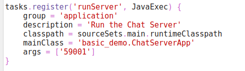

**Execution:**

```bash
./gradlew runServer
```

---

### Add Unit Test

A JUnit dependency was added, and a simple unit test was created in the `src/test/java` directory.
Gradle automatically recognizes this folder and includes a default `test` task.

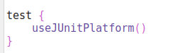
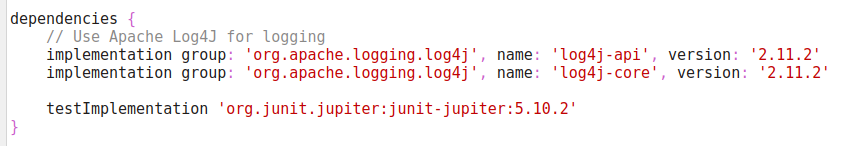

**Execution:**

```bash
./gradlew test
```

---

### Add Task to Make Backup of Source Code

A task was created to copy the `src` directory into a backup folder.
It checks whether the destination directory exists and creates it if necessary using `mkdir`.

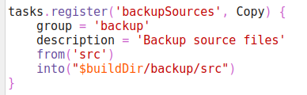

---

### Add Task to Archive Backup of Source Code in ZIP

This task generates a `.zip` file containing the application backup.
The file name includes the current date to easily distinguish between different versions.

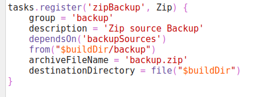

**Execution:**

```bash
./gradlew zipArchive
```

The result is a ZIP file created inside the project’s `archive` folder.

---

### Conclusions

##### Why was it not necessary to download a specific gradle/jdk version?

The reason was that when we use the gradle wrapper the first time, it will automatically download a compatible 
version of gradle to the machine. Gradle can find and work with different versions of the JDK in the same project, 
but it is recommended that a specific version is chosen.

**Command `gradle –q javaToolchain`:**

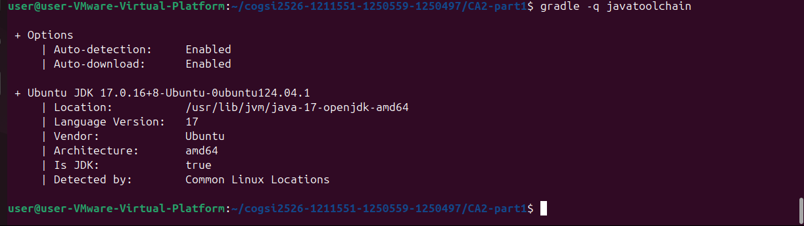

Displays the Java versions installed on the system and the one used by the project, Java 17.

---


## Part 2 

In this part that object is to convert the project that we worked on in CA1 from maven into a gradle project.

### Initializing project 

We began this stage by creating a new Gradle project using the command:

```bash
gradle init
```

After initializing the project, we **copied the `src` folder** from the previous Maven project (used in CA1) into this new Gradle project located under the `CA2/part2` directory.  
This ensured that the application code remained the same while the build tool was replaced.


### Setting up dependencies 

Next, we needed to **convert and configure the dependencies and plugins** from the Maven format to the Gradle format.  
Since both tools use **Maven Central** as the default repository, the process mainly involved adjusting the syntax.

In the original Maven project, dependencies were defined like this:

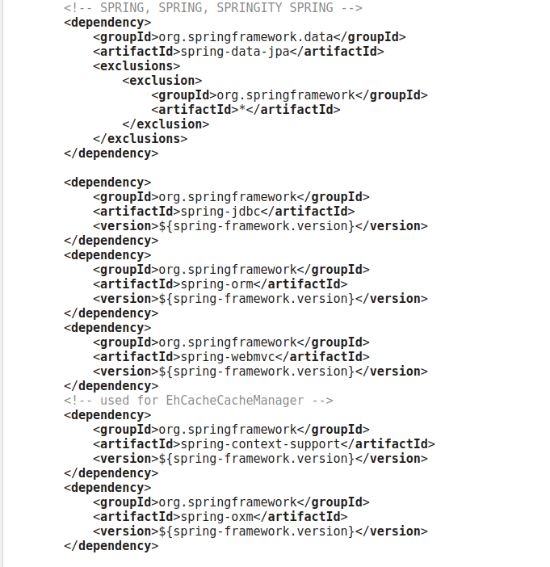


To adapt them for Gradle, the XML syntax had to be rewritten using Gradle’s DSL notation:

```groovy
dependencies {
    implementation '<groupId>:<artifactId>'
    runtimeOnly '<groupId>:<artifactId>'
    testImplementation '<groupId>:<artifactId>'
}
```

After conversion, the dependencies appeared as follows:


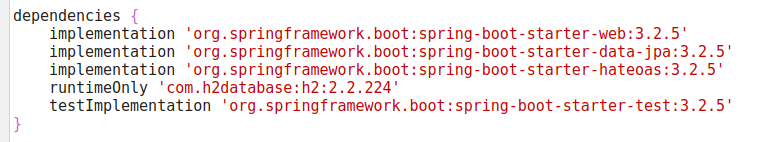


The next step was to configure the plugins.  
In CA1, the Maven project only used **one plugin**, which was the Spring Framework plugin for Maven.  
For Gradle, we needed to replace it with the corresponding **Spring plugin for Gradle projects**.

**Maven plugin:**

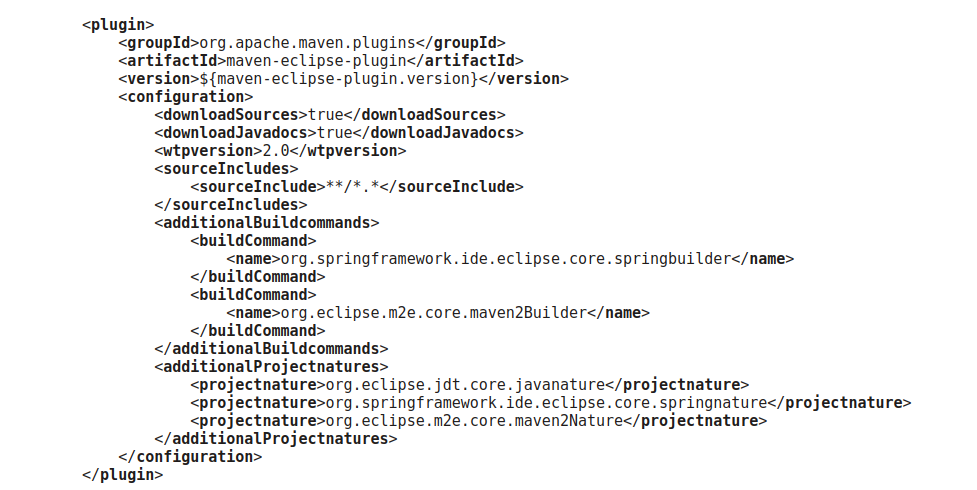

**Gradle plugin:**

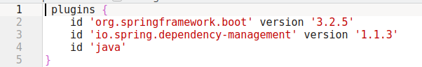

---

### Implementation of Tasks

In this section, we present the **custom Gradle tasks** implemented in the converted Spring Boot project.  
Each task serves a specific purpose, from deployment preparation to documentation and integration testing.

---

#### Task to Run the Application Using Generated Distribution Scripts

This task, named `runFromDist`, is responsible for running the application using the executable scripts generated by the `installDist` task.  
It automatically determines the correct script to execute based on the operating system — `.bat` for Windows or shell script for Unix-like systems.  
It ensures the distribution is installed before execution and launches the application process directly from the generated distribution folder.

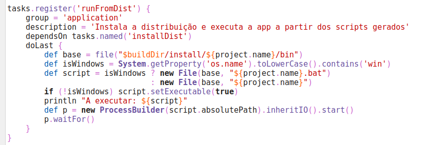

This allows the project to be executed with:
```bash
./gradlew runFromDist
```

---

#### Task to Generate Javadocs and Create a ZIP File

The project includes a `javadocZip` task that automatically generates Javadoc documentation and compresses it into a `.zip` file.  
It depends on the built-in `javadoc` task and outputs the archive to the `build/docs` directory.

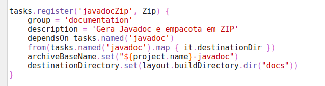

The task can be executed with:
```bash
./gradlew javadocZip
```

Once completed, the generated documentation will be located in `build/docs`.

---

#### Deployment Tasks

To automate deployment preparation, several related tasks were defined:

- **`deletePasta`** – cleans the deployment directory.  
- **`copyApp`** – copies the application JAR generated by `bootJar` into the deployment directory.  
- **`copyRuntimeLibs`** – copies all required runtime dependencies (`.jar` files).  
- **`copyConfigs`** – copies configuration files from `src/main/resources`, replacing tokens with project version and timestamp.  
- **`deployToDev`** – a parent task that depends on the previous ones and prints the deployment location.

Example excerpt:

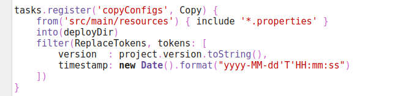

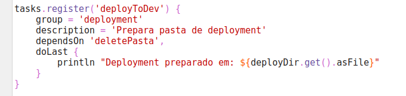

To execute:
```bash
./gradlew deployToDev
```

---

#### Creating a New Source Set for Integration Tests

A new **integration test source set** was created to separate integration tests from unit tests.  
This allows for independent execution of both types.

**Source set configuration:**

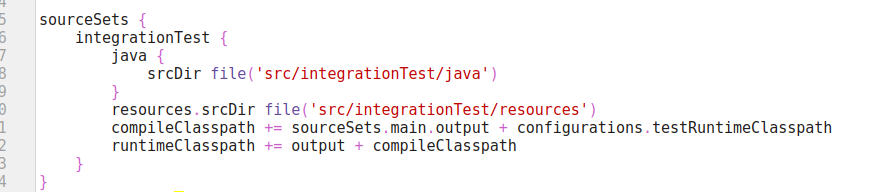


**Dependencies and configuration:**

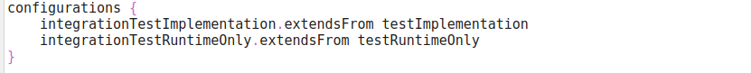

**Integration test task:**

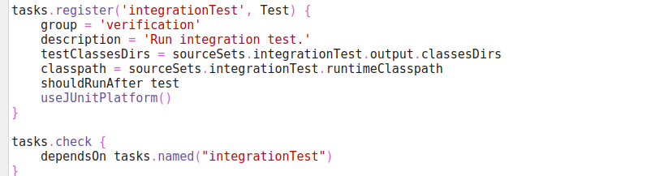

Run integration tests with:
```bash
./gradlew integrationTest
```

This configuration enables full separation between **unit** and **integration** test stages while maintaining compatibility with JUnit 5.

---

## Alternative Build System: Apache Ant + Ivy

### Overview

As an alternative to Gradle, we implemented the same Spring Boot project using **Apache Ant** combined with **Apache Ivy** for dependency management.
This approach provides full control over the build process while retaining automated dependency resolution — much like Maven or Gradle.
The objective was to replicate the same build flow (compilation, packaging, and execution) but using Ant scripts instead of Gradle’s DSL.


---

### Configuration Details

#### build.xml

This file defines the main build lifecycle and the automation flow:


```xml
<project name="payroll_ant" default="run" basedir="." xmlns:ivy="antlib:org.apache.ivy.ant">

  <property name="src.dir" value="src/main/java"/>
  <property name="build.dir" value="build"/>
  <property name="classes.dir" value="${build.dir}/classes"/>
  <property name="lib.dir" value="lib"/>
  <property name="main.class" value="payroll.PayrollApplication"/>

  <!-- Load Ivy -->
  <taskdef uri="antlib:org.apache.ivy.ant"
           resource="org/apache/ivy/ant/antlib.xml"
           classpath="/usr/share/java/ivy.jar"/>

  <!-- Download dependencies -->
  <target name="resolve">
    <mkdir dir="${lib.dir}"/>
    <ivy:resolve/>
    <ivy:retrieve pattern="${lib.dir}/[artifact]-[revision].[ext]"/>
  </target>

  <!-- Clean previous builds -->
  <target name="clean">
    <delete dir="${build.dir}"/>
  </target>

  <!-- Compile source code -->
  <target name="compile" depends="resolve">
    <mkdir dir="${classes.dir}"/>
    <javac srcdir="${src.dir}" destdir="${classes.dir}" includeantruntime="false"
           source="17" target="17" encoding="UTF-8">
      <compilerarg value="-parameters"/>
      <classpath>
        <fileset dir="${lib.dir}">
          <include name="**/*.jar"/>
        </fileset>
      </classpath>
    </javac>
  </target>

  <!-- Run the Spring Boot application -->
  <target name="run" depends="compile">
    <java classname="${main.class}" fork="true">
      <classpath>
        <pathelement path="${classes.dir}"/>
        <fileset dir="${lib.dir}">
          <include name="**/*.jar"/>
        </fileset>
      </classpath>
    </java>
  </target>

</project>
```

---

#### ivy.xml

This file defines all the dependencies required by the project, matching those used in the Gradle version.

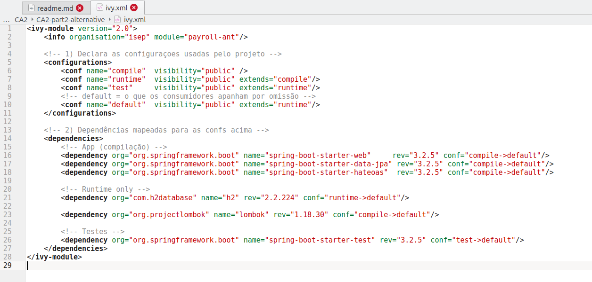

---

### Execution Steps

To build and run the project using Ant + Ivy:

```bash
# Remove previous builds and libraries
rm -rf lib build
```

# Resolve dependencies via Ivy
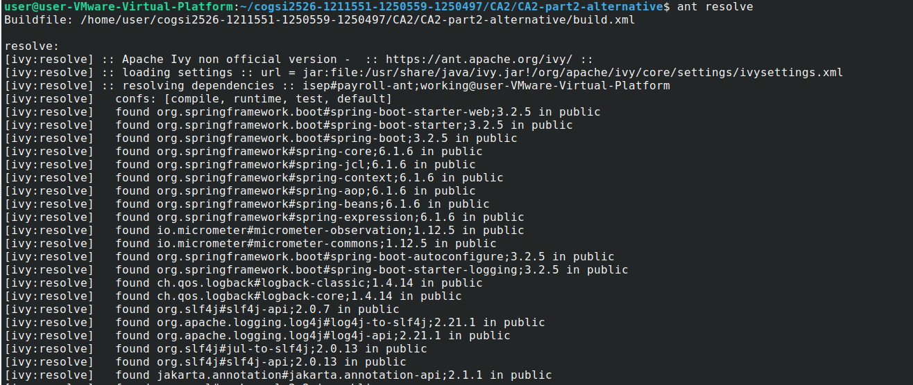


# Compile source code
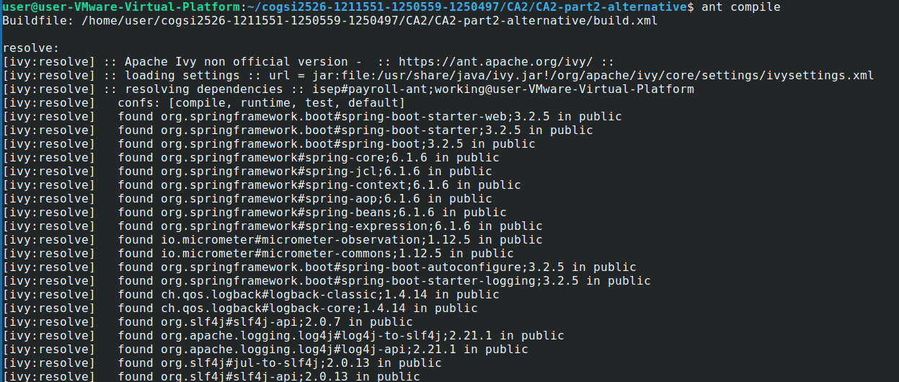

# Run the Spring Boot application
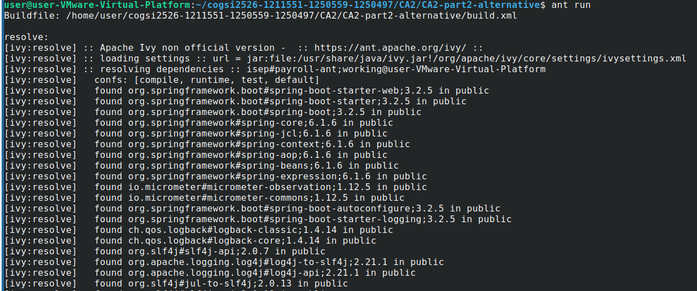


If successful, the application starts on `http://localhost:8080`.

---

### Results and Observations

| Aspect | Gradle | Ant + Ivy |
|--------|---------|-----------|
| **Dependency Management** | Integrated (`build.gradle`) | External via `ivy.xml` |
| **Ease of Use** | Simplified via plugins | Manual and verbose |
| **Performance** | Incremental builds | Full rebuilds |
| **Flexibility** | Groovy/Kotlin DSL | XML-based tasks |
| **Learning Value** | Abstracts build logic | Exposes full build process |

While Gradle is more modern and automated, using **Apache Ant + Ivy** provided valuable insights into how builds are structured and how dependency resolution works under the hood. Despite being more manual, this setup successfully replicated the Gradle configuration and proved stable for Java-based projects.

---

# Self-Assessment of Contributions

| Membro | ID | Contribuição (%) |
|---------|----|------------------|
| Sofia Marques | 1250559 | 33.3% |
| Alexandre Vieira | 1211551 | 33.3% |
| Bárbara Silva | 1250497 | 33.3% |
