# CA3 - Virtualization

---

## Objectives

The objective of this assignment is to **understand and apply virtualization technologies**, focusing on **Vagrant**, and to compare its use with other alternatives.

CA3 is divided into two main parts and one alternative:

* **Part 1:** Use of **Vagrant** to virtualize and automate the setup of the applications developed in CA2.

* **Part 2:** Deployment of a multi-VM environment using **Vagrant**, separating the application and database servers.

* **Alternative:**  Implementation and analysis of an equivalent solution using **Multipass** as an alternative virtualization tool.

---

# Analysis of Vagrant and Alternatives 

### Vagrant

Vagrant is a tool developed by HashiCorp to create and configure reproducible development environments. It uses configuration files (Vagrantfiles) to automate the setup of virtual machines and can integrate with a variety of providers, such as VirtualBox, VMware, and Hyper-V. It also supports provisioning through shell scripts or configuration management tools like Ansible and Puppet.

#### Advantages and shortcomings

Some advantages of using Vagrant are:

* It is simple to learn and well-documented.
* It allows consistent environments across multiple operating systems and hosts.
* It integrates with several providers like VirtualBox and VMware, which are widely used.
* Supports provisioning automation, which helps in installing dependencies and configuring the environment reproducibly.

Some shortcomings are:

* It is relatively heavy on system resources compared to container-based solutions.
* It is usually used only for development purposes, not production.
* It depends on the underlying provider (VirtualBox, VMware), and small differences in provider configurations can lead to inconsistent results.

---

### Alternatives

While there are no exact one-to-one replacements for Vagrant, there are several tools that offer overlapping functionality, especially regarding virtualization and environment automation. Among them are **LXD** and **Multipass**, both developed by Canonical, which provide more lightweight or specialized approaches.

---

#### LXD

**LXD** is an open-source tool developed by Canonical for managing **system containers and virtual machines**. Unlike Docker, which runs application containers, LXD provides full system containers that behave much like virtual machines but are more efficient because they share the same kernel as the host. It can also run KVM-based virtual machines when full virtualization is required.

LXD is controlled mainly through the command line or REST API and allows administrators to define automation scripts to manage container creation, networking, and provisioning.

##### Advantages and shortcomings

Some advantages of using LXD are:

* It is lightweight and faster to start than traditional virtual machines.
* It allows both container-based and VM-based virtualization in one platform.
* Official images are maintained by Canonical, ensuring reliability and stability.
* It is very flexible and supports custom automation through scripts or APIs.

Some shortcomings are:

* It is more complex to configure manually compared to Vagrant’s Vagrantfile approach.
* It primarily supports Linux systems, lacking support for Windows-based guests.
* Requires some networking knowledge to properly configure communication between containers or VMs.

LXD is a suitable candidate for implementing the alternative solution, as it closely replicates Vagrant’s functionality while offering improved performance and efficiency. It allows a similar workflow with greater control and lower overhead, which makes it a good choice for system-level virtualization and automation.

---

#### Multipass

**Multipass** is another tool developed by Canonical that focuses on quickly creating and managing lightweight Ubuntu virtual machines. It is designed for simplicity and is ideal for developers who need instant access to a clean Ubuntu environment. Multipass can use backends like QEMU, Hyper-V, or VirtualBox, depending on the host system.

It is less configurable than Vagrant or LXD but excels at rapid prototyping and testing environments.

##### Advantages and shortcomings

Some advantages of using Multipass are:

* Extremely easy to set up and use with a minimal command-line interface.
* Fast VM creation and low resource overhead.
* Integrates well with Ubuntu and Canonical’s cloud tools.
* Ideal for quick development or testing tasks.

Some shortcomings are:

* Limited configuration options compared to Vagrant and LXD.
* Only supports Ubuntu-based images.
* Not suited for complex or multi-VM environments.
* Does not include built-in provisioning mechanisms.

Multipass is an excellent option for quick and simple setups but lacks the flexibility required for complex multi-machine environments like those in this assignment.

---

### Comparison Summary

| Tool          | Type of Virtualization                  | Performance  | Configuration Complexity | Provisioning Support         | OS Support     | Ideal Use Case                          |
| ------------- | --------------------------------------- | ------------ | ------------------------ | ---------------------------- | -------------- | --------------------------------------- |
| **Vagrant**   | Full virtualization (VMs via providers) | Medium       | Moderate                 | Yes (via scripts/Ansible)  | Cross-platform | Reproducible dev/test environments      |
| **LXD**       | System containers & VMs                 | High      | Moderate to high         | Partial (via API/scripts) | Linux          | Lightweight multi-instance environments |
| **Multipass** | Lightweight VMs (Ubuntu only)           | Very High | Low                      | No native provisioning     | Ubuntu         | Rapid prototyping and testing           |

---

# CA3 — Implementation - Part 1


In this section we will go over the configuration of the VM for part1 of the assignment.

#### Create VM  and install dependencies using a provisioning shell script

To initialize a Vagrant vm, we can run :
```console
vagrant init
```
When we initialize a new Vagrant environment, a file named **Vagrantfile** is automatically generated with a basic predefined configuration. If we specify a particular base image, Vagrant will include that image in the configuration — whether it’s from the Vagrant Cloud or another source.

Alternatively, we can create and configure the Vagrantfile manually, which is the approach we decided to take.

We started by creating the provisioning script, since it’s the simplest component. Its purpose is to update the system and install the required packages using APT. The script looked as follows:

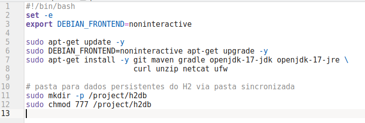


Next, we configured the virtual machine using the Vagrantfile, adding a line to ensure that this provisioning script is executed automatically when the VM is created.

For this and all subsequent VMs used in Vagrant, we chose the ubuntu/bento box, as it provides the latest stable Ubuntu environment.

At this stage, our Vagrantfile looked similar to the following:

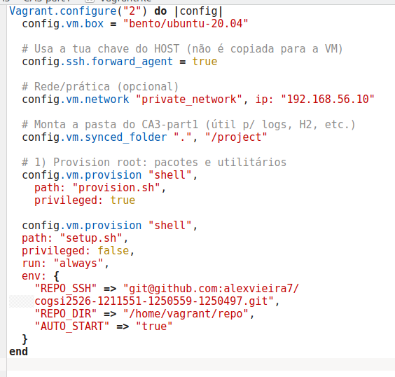


#### Cloning and executing projects inside the VM

During the provisioning phase, the repository is automatically cloned inside the VM by the setup.sh script, which uses the environment variables defined in the Vagrantfile.
Therefore, once inside the VM, the repository is already available in the specified directory, ready for use.

---

#### Cloning and Executing Projects Inside the VM

The `setup.sh` script is responsible for **cloning the repository**, **updating it if it already exists**, and **optionally starting the applications** inside the virtual machine.
It is designed to be **idempotent**, meaning it can run multiple times without causing issues or breaking the system state.

---

##### Overview

The script automates the setup of the development environment during Vagrant provisioning.
It performs the following tasks:

* Creates necessary directories and SSH configurations.
* Clones the repository from GitHub (or updates it if already cloned).
* Makes startup scripts executable.
* Optionally starts the applications in the background, redirecting logs to `/tmp`.

---

##### Environment Variables

The following environment variables are passed from the `Vagrantfile`:

```bash
REPO_SSH="${REPO_SSH:-}"                     # SSH URL of the repository (required)
REPO_DIR="${REPO_DIR:-/home/vagrant/repo}"   # Base directory for the repository
TARGET="$REPO_DIR/$REPO_NAME"                # Final path for the checkout
AUTO_START="${AUTO_START:-true}"             # Automatically start apps after provisioning
```

The script terminates early if `REPO_SSH` is not defined, ensuring proper configuration.
Default paths are located under `/home/vagrant`, keeping the setup isolated from the root environment.

---

##### Environment Preparation


These commands prepare the file structure and add GitHub’s host key to the `known_hosts` file to avoid SSH confirmation prompts during cloning or pulling.

---

##### Repository Cloning or Updating

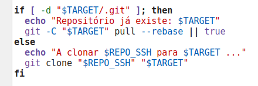

* If the repository already exists, it performs a **`git pull --rebase`** to update it.
* Otherwise, it clones the repository from the given SSH URL.
* The use of `|| true` ensures the provisioning process continues even if network issues occur.

---

##### Setting Executable Permissions

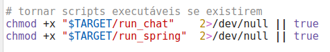

This step ensures that the startup scripts (if present) are executable. Missing files are ignored to maintain smooth provisioning.

---

##### Automatic Startup and Logging

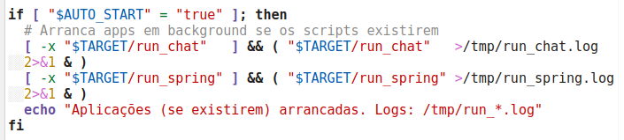

If `AUTO_START` is set to `true`, the script runs the applications in the background and redirects their output to `/tmp/run_*.log`.
This enables quick validation after `vagrant up` without requiring manual intervention.

---

#### Connecting the Host Machine to the Virtual Environment

In  order to create and configure the VM using *vagrant*, the command *vagrant up* is run.
By doing so, the machine is instantiated and configured according to *Vagrantfile*, *provision.sh* and setup *setup.sh*.
The output is the following, confirming the machine was successfully configured.

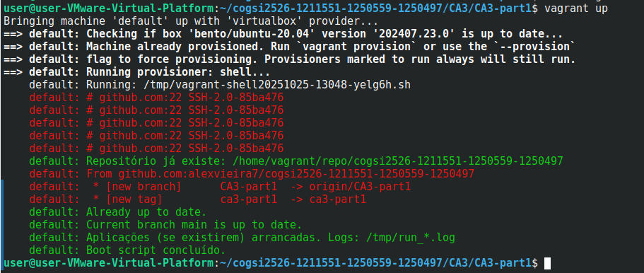

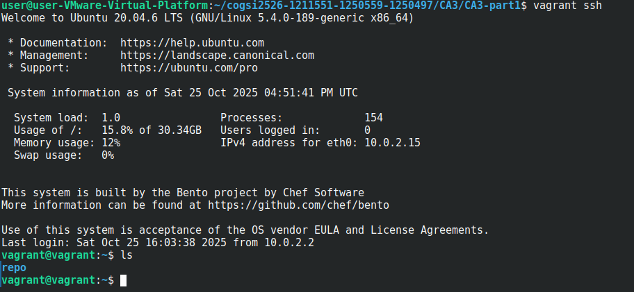

To run the chat application, the following command is executed inside the virtual machine:

```console
./gradlew run
```
This command ensures that the appropriate version of Gradle is installed (if it isn’t already) and then starts the application.

The functionality of the application can be verified by accessing it through the browser on the host machine.

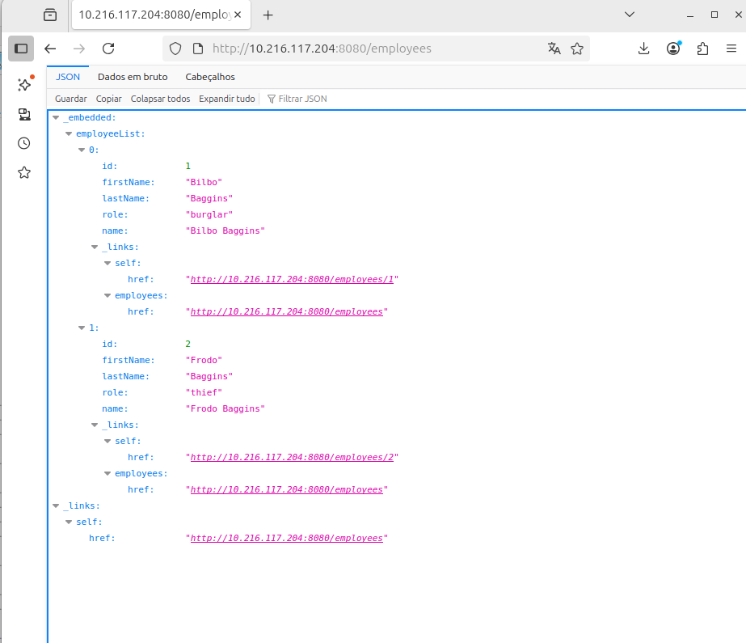

Subsequently, the chat server was launched within the VM, while the chat client was run from the host machine.

To start the chat server, we use the command below within the VM:

```console
./gradlew runServer
```
This will automatically install the correct Gradle version if necessary and start the server.

To test the server, we can connect to it using the following command:

```console
telnet  <app-port>
```
If the setup is correct and the application is running properly, this command should produce a similar output.

---

# CA3 – Part 2 · Vagrant Virtualization (App + Database)

> **Goal:** Split the Spring Boot application and the H2 database into two separate virtual machines using **Vagrant**, connected through a **private network**, ensuring data persistence, startup order, and restricted communication via a firewall.

---

## Architecture Overview

| Component          | VM Name | IP Address                                            | Purpose                                                                           | Key Ports |
| ------------------ | ------- | ----------------------------------------------------- | --------------------------------------------------------------------------------- | --------- |
| **Database VM**    | `db`    | `192.168.56.10`                                       | Runs **H2 database** in *server mode* with persistent storage at `/project/h2db`. | TCP 9092  |
| **Application VM** | `app`   | (auto-assigned by Vagrant, typically `192.168.56.11`) | Runs the **Spring Boot app**, connects remotely to the H2 server.                 | TCP 8080  |

* Both VMs use the base box `ubuntu/bento`.
* A shared folder (`"/project"`) ensures the H2 data directory persists even after the VMs are destroyed.
* The firewall on the DB VM allows access to port 9092 **only** from the App VM.

---

## Implementation Walkthrough (Step-by-Step)

### Step 1 – Define the VMs (`Vagrantfile`)

**Vagrantfile** provisions two virtual machines:

```ruby
Vagrant.configure("2") do |config|
  config.vm.box = "bento/ubuntu-20.04"
  config.ssh.forward_agent = true

  # ===== DB VM =====
  config.vm.define "db" do |db|
    db.vm.hostname = "db"
    db.vm.network "private_network", ip: "192.168.56.10"
    db.vm.synced_folder ".", "/project"

  # ===== APP VM =====
  config.vm.define "app" do |app|
    app.vm.hostname = "app"
    app.vm.network "private_network", ip: "192.168.56.11"
    app.vm.network "forwarded_port", guest: 8080, host: 8080, auto_correct: true
    app.vm.synced_folder ".", "/project"

    app.vm.provision "shell",
      path: "provision.sh",
      privileged: true

    app.vm.provision "shell",
      path: "setup.sh",
      privileged: false,
      run: "always",
      env: {
        "REPO_SSH"   => "git@github.com:alexvieira7/cogsi2526-1211551-1250559-1250497.git",
        "REPO_DIR"   => "/home/vagrant/repo",
        "AUTO_START" => "true",
        "DB_HOST"    => "192.168.56.10",
        "DB_PORT"    => "9092",
        "DB_PATH"    => "/project/h2db/ca3-db",
        "APP_SUBPATH"=> "CA2/CA2-part2/rest"
      }
  end
end
```

This creates two Ubuntu VMs on a private network and forwards your SSH agent (so the App VM can `git clone` a private repo).

---

### Step 2 – Base Provisioning (`provision.sh`)

Executed on *both VMs*, this script:

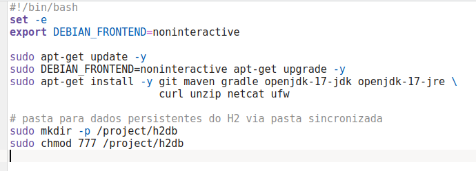

**Purpose:**

* Ensures all Java and build tools are available.
* Creates `/project/h2db` which is **shared** with the host for persistence.
* Installs UFW and Netcat (used later for firewall + startup check).

---

### Step 3 – Database VM Setup

You can start the H2 server manually or automate it with systemd.

#### Option A – Manual start

SSH into the DB VM:

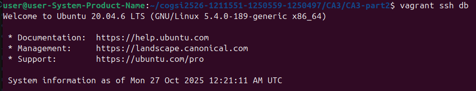

Download H2 jar and run it as a background process:

```bash
mkdir -p /opt/h2
cd /opt/h2
wget https://repo1.maven.org/maven2/com/h2database/h2/2.2.224/h2-2.2.224.jar -O h2.jar
nohup java -jar h2.jar -tcp -tcpAllowOthers -tcpPort 9092 -baseDir /project/h2db > /tmp/h2.log 2>&1 &
```

#### Option B – As a systemd service

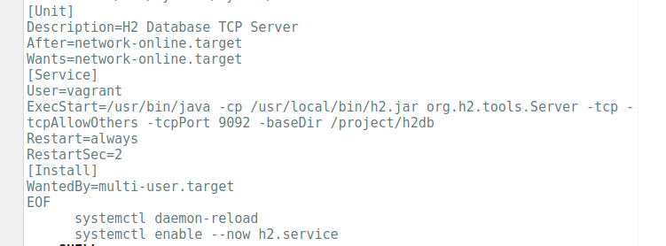

Now the H2 database runs persistently on boot, serving TCP 9092.

---

### Step 4 – Firewall on DB VM (UFW)

```bash
sudo ufw default deny incoming
sudo ufw allow from 192.168.56.11 to any port 9092 proto tcp
sudo ufw allow ssh
sudo ufw --force enable
sudo ufw status verbose
```

Only the App VM (192.168.56.11) can connect to H2.

---

### Step 5 – App VM Setup (`setup.sh`)

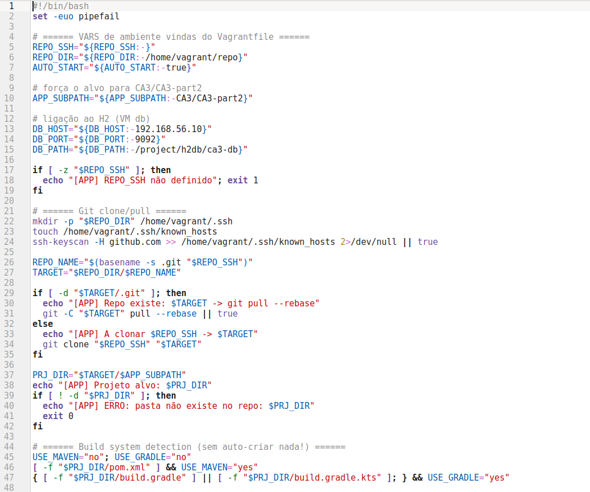

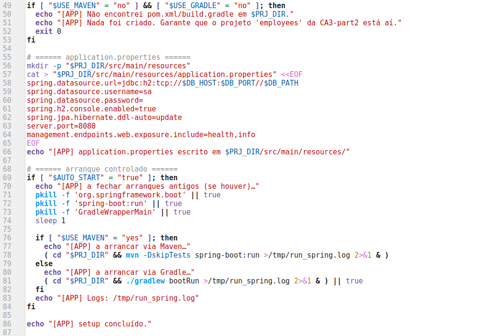

Key features:

* Waits until the H2 server is reachable.
* Dynamically configures JDBC URL:
  `jdbc:h2:tcp://192.168.56.10:9092//project/h2db/ca3-db`
* Supports both Maven and Gradle builds.
* Starts the app automatically if `AUTO_START=true`.

---

### Step 6 – Startup Sequence (Automatic Order)

1. `vagrant up` → creates both VMs.
2. `db` VM runs `provision.sh` + H2 server.
3. `app` VM runs `provision.sh` then `setup.sh`.
4. `setup.sh` waits for H2 to be ready before launching the app.
5. The app connects to H2 over the private network using TCP 9092.

---

## 4. How to Run Everything

### Initial Setup

```bash
vagrant up
```

Vagrant will:

1. Spin up both VMs.
2. Run provisioning scripts.
3. Launch H2 server and Spring Boot app automatically.

---

## Setup Secure SSH Keys for Secure Access

To ensure secure access to our virtual machines (VMs), we configured custom SSH keys instead of relying on Vagrant’s default insecure key.

### SSH Key Generation

The SSH keys were **generated locally on the user’s host machine** that runs the project.
Each VM (`db` and `app`) has its own private key, stored securely on the local system.

For security reasons, **these private keys were not included in the project repository** to prevent any exposure of sensitive credentials.
Only the public keys were used inside the VMs for authentication.

>  **Note:** The private keys are located in the user’s `.ssh` folder on the host machine, outside of the project directory.

---

### Configuration in the Vagrantfile

In the `Vagrantfile`, lines were added (or left commented) that allow Vagrant to replace the default insecure key with a newly generated secure key automatically.
This approach ensures Vagrant manages the keys securely without requiring private keys to be stored in the project.

```ruby
# Example configuration in Vagrantfile
# db.ssh.private_key_path = ["~/.ssh/id_rsa_db"]
# app.ssh.private_key_path = ["~/.ssh/id_rsa_app"]
```

---

### Applying the Changes

After updating the configuration, the VMs were reloaded so the new SSH keys would take effect:

```bash
vagrant reload --provision
```

---

### Accessing the VMs

The VMs can be accessed securely via SSH from the host machine using the locally stored private keys:

```bash
ssh -i ~/.ssh/id_rsa_db vagrant@192.168.56.10
ssh -i ~/.ssh/id_rsa_app vagrant@192.168.56.20
```

---

### Updating the *known_hosts* File

If older SSH host keys existed for the same VM IPs, they can be removed with:

```bash
ssh-keygen -f "~/.ssh/known_hosts" -R "192.168.56.10"
ssh-keygen -f "~/.ssh/known_hosts" -R "192.168.56.20"
```

---


### Verify Status

#### On DB VM:

```bash
vagrant ssh db
sudo systemctl status h2   # or check nohup if manual start
ss -tln | grep 9092
sudo ufw status
```

#### On App VM:

```bash
vagrant ssh app
curl <http://localhost:8080>
```

You should see:

```json
{"status":"UP"}
```

Then, open in your host browser:

```
http://192.168.56.11:8080/h2-console
```

Use these credentials:

```
JDBC URL: jdbc:h2:tcp://192.168.56.10:9092//project/h2db/ca3-db
User: sa
Password: (empty)
```

---


# CA3 — Alternative Solution Using Multipass - Part 1

---

## Objectives

The objective of this alternative approach was to replace **Vagrant** with **Multipass** for automated provisioning and deployment of the **CA2 application**.
The focus was on ensuring that the environment could:

* Automatically install all necessary dependencies.
* Clone the project repository from GitHub.
* Build and deploy both the **Spring Boot** and **Gradle** components.
* Launch the web application on port **8080** using a persistent **H2 database**.

---

## System Design

The solution uses **Multipass** with a **cloud-init** configuration file (`user-data.yaml`) that performs all steps automatically when the virtual machine is launched.

This approach keeps the spirit of CA3 (provisioning, automation, persistence) but uses Multipass’s built-in declarative provisioning instead of Vagrant’s `Vagrantfile`.


---


# Analysis and Problem Diagnosis


## Identified Issues

When migrating from the original Vagrant-based setup to Multipass, several issues were encountered that prevented the application from deploying correctly.

### File Permission and Ownership Problems

The provisioning script executed as `root`, so build artifacts (`target/`, `repo/`) were owned by `root`.
This caused `mvn clean` to fail when run by `ubuntu`.

---

## Implementation Approach

### Package Installation

Cloud-init installs all dependencies required by CA2:

```yaml
packages:
  - git
  - openjdk-17-jdk
  - maven
  - gradle
  - unzip
  - rsync
```

These cover both the Maven-based Spring Boot project and the Gradle demo project.

---

### 2.2  Automated Boot Script

A provisioning script (`/usr/local/bin/ca3_boot.sh`) is written during VM creation and executed automatically on first boot.

Its responsibilities:

1. Create necessary directories (`/opt/ca3`, `/var/h2`, `/var/log/ca3`)
2. Clone the GitHub repository (via SSH or HTTPS fallback)
3. Generate a persistent `application.properties` for the H2 database
4. Build the Spring Boot project with Maven
5. Launch the application in background and verify that port 8080 is active

---

### 2.3  Persistent H2 Database

To ensure persistence across restarts, the database path is stored on disk under `/var/h2`, outside the build directory.

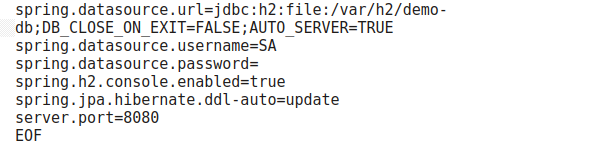

**Rationale:**

* `file:/var/h2/demo-db` keeps data between VM reboots
* `AUTO_SERVER=TRUE` allows multiple connections
* `DB_CLOSE_ON_EXIT=FALSE` avoids loss of data on shutdown
* The configuration mirrors CA3’s persistence requirement


---

### `user-data.yaml`

The final **cloud-init configuration** (`user-data.yaml`) encapsulates the entire provisioning logic, making the VM self-contained and reproducible.

```yaml
#cloud-config
package_update: true
packages:
  - git
  - openjdk-17-jdk
  - maven
  - gradle
  - unzip
  - rsync

write_files:
  - path: /usr/local/bin/ca3_boot.sh
    permissions: '0755'
    content: |
      #!/usr/bin/env bash
      set -euo pipefail

      BASE=/opt/ca3
      APP="$BASE/repo/CA2/CA2-part2/evolution"
      LOG_DIR=/var/log/ca3
      H2_DIR=/var/h2

      sudo mkdir -p "$BASE" "$LOG_DIR" "$H2_DIR"
      sudo chown -R ubuntu:ubuntu "$BASE" "$LOG_DIR" "$H2_DIR"

      # Clone repository
      sudo -u ubuntu -H bash -lc "git clone --depth=1 git@github.com:alexvieira7/cogsi2526-1211551-1250559-1250497.git '$BASE/repo'" || true

      # Create application.properties
      mkdir -p "$APP/src/main/resources"
      cat > "$APP/src/main/resources/application.properties" <<'EOF'
      spring.datasource.url=jdbc:h2:file:/var/h2/demo-db;DB_CLOSE_ON_EXIT=FALSE;AUTO_SERVER=TRUE
      spring.datasource.username=SA
      spring.datasource.password=
      spring.h2.console.enabled=true
      spring.jpa.hibernate.ddl-auto=update
      server.port=8080
      EOF

      # Build and launch Spring Boot
      (cd "$APP" && mvn -DskipTests clean package)
      nohup java -jar "$APP/target/"*.jar > "$LOG_DIR/spring.log" 2>&1 &
      sleep 5
      ss -tulpn | grep :8080 || echo "[WARNING] Server may still be starting"
```

---

# Execution and Validation

---

## Steps to Run the Alternative Solution

### Step 1 — Launch the VM

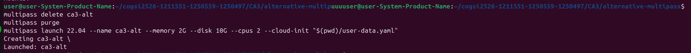


This creates and configures the entire environment automatically.

---

### Step 2 — Transfer SSH Key

If cloning via SSH:

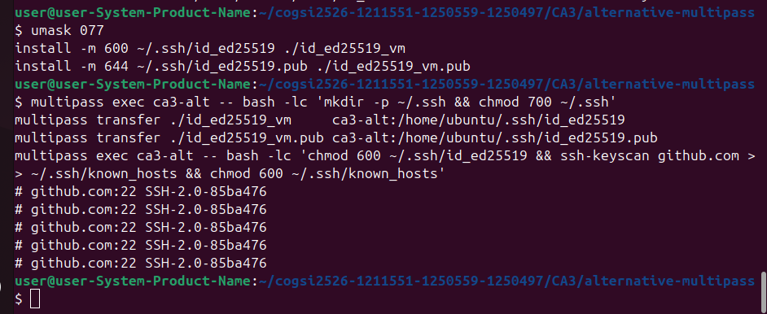

---

### Step 3 — Use ssh to clone the repo

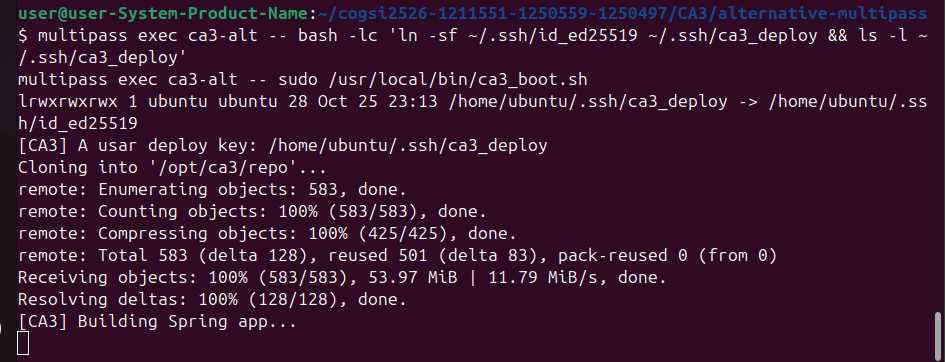

---

### Step 4 — Check Logs and Active Process

```bash
multipass exec ca3-alt -- sudo tail -n 80 /var/log/ca3/spring.log
```

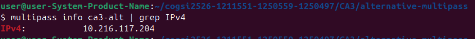

---

### Step 5 — Test the REST API

```bash
IP=$<VM_IP>
curl http://$IP:8080/employees
```

**Expected output:**

```json
[
  {"id":1,"name":"Bilbo Baggins","role":"burglar"},
  {"id":2,"name":"Frodo Baggins","role":"thief"}
]
```

---

# CA3 — Alternative Solution Using Multipass - Part 2

The setup replicates the objectives of CA3 – Part 2, where one virtual machine hosts the Spring Boot application and another hosts the H2 database in server mode, enabling communication between them over a shared TCP connection.

The document explains the configuration steps, network setup, and provisioning process for both virtual machines, while highlighting how this alternative tool compares to Vagrant in terms of ease of automation, resource management, and isolation.

---

## Architecture Overview

* **VM `db`** — runs the H2 TCP server
* **VM `app`** — runs the Spring Boot JAR connecting to the H2 database over TCP

Each VM is isolated but networked internally by Multipass.

---

## Create the shared H2 data directory

```bash
mkdir -p h2data
```

This directory will be mounted into the `db` VM to persist the H2 database.

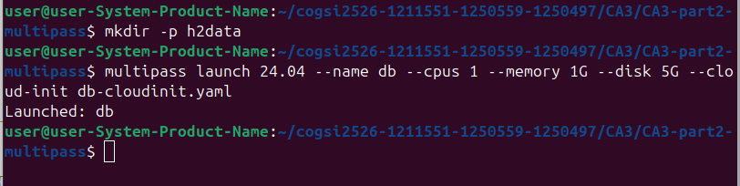

---

## Launch the database VM

```bash
multipass launch 24.04 --name db --cpus 1 --memory 1G --disk 5G --cloud-init db-cloudinit.yaml
```

*(the VM will be created and initialized automatically)*

---

## Mount the shared folder into the database VM

```bash
multipass mount ./h2data db:/project/h2db
```

This allows the host machine to share the `/project/h2db` directory inside the `db` VM, where the database files are stored.

---

## Retrieve the database IP

```bash
DB_IP=$(multipass exec db -- bash -lc "hostname -I | awk '{print \$1}'")
echo "$DB_IP"
```

Example output:

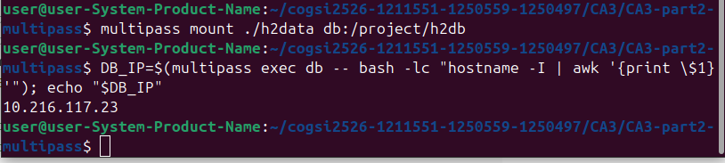

---

## Open the H2 server port on the database VM

We’ll ensure TCP port `9092` is open so the app VM can connect:


---

## Launch the application VM

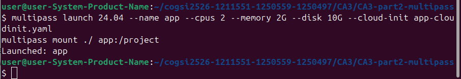

---

## Start the H2 server on the DB VM

```bash
multipass exec db -- bash -lc '
  wget -q https://repo1.maven.org/maven2/com/h2database/h2/2.2.224/h2-2.2.224.jar -O /tmp/h2.jar
  sudo mkdir -p /project/h2db && sudo chmod -R 777 /project/h2db
  pkill -f org.h2.tools.Server || true
  nohup java -cp /tmp/h2.jar org.h2.tools.Server \
    -tcp -tcpAllowOthers -tcpPort 9092 \
    -baseDir /project/h2db -ifNotExists \
    > /var/log/h2-server.log 2>&1 &
'
```

This runs the H2 server in TCP mode with data persistence.

---

## Start the Spring Boot application on the APP VM

We create a temporary configuration file to ensure the app uses the correct H2 connection:

```bash
multipass exec app -- bash -lc "
  sudo mkdir -p /var/log/ca3 && sudo truncate -s 0 /var/log/ca3/spring.log

  cat >/tmp/override.properties <<EOF
spring.datasource.url=jdbc:h2:tcp://$DB_IP:9092//project/h2db/ca3-db;DB_CLOSE_ON_EXIT=FALSE
spring.datasource.username=sa
spring.datasource.password=
spring.datasource.driver-class-name=org.h2.Driver
spring.jpa.hibernate.ddl-auto=update
spring.jpa.database-platform=org.hibernate.dialect.H2Dialect
server.port=8080
server.address=0.0.0.0
EOF

  APP_JAR=/home/ubuntu/repo/.../CA2/CA2-part2/evolution/target/evolution-0.0.1-SNAPSHOT.jar

  nohup java -jar \"\$APP_JAR\" \
    --spring.config.location=classpath:/,file:/tmp/override.properties \
    >> /var/log/ca3/spring.log 2>&1 &
"
```

After a few seconds, should see in the logs:

```
Tomcat started on port 8080
Started PayrollApplication
```

---

## Test the application

Get the `app` VM’s IP address:

```bash
APP_IP=$(multipass exec app -- bash -lc "hostname -I | awk '{print \$1}'")
echo "App available at http://$APP_IP:8080"
```

Open this URL in your browser:

```
http://<APP_IP>:8080/employees
```

Them should see the initial employee list returned as JSON:

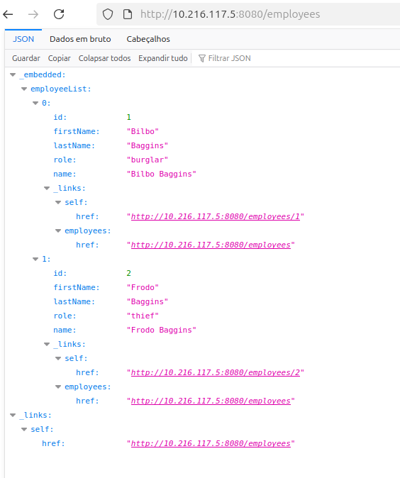

---

## Comparative Analysis — Vagrant vs Multipass

| **Aspect**               | **Vagrant**                                                         | **Multipass (Alternative Solution)**                                     |
| ------------------------ | ------------------------------------------------------------------- | ------------------------------------------------------------------------ |
| **Provisioning Model**   | Procedural — uses shell scripts defined within a `Vagrantfile`.     | Declarative — uses `cloud-init` YAML for first-boot automation.          |
| **Base Image Source**    | Custom “boxes” (community or self-built).                           | Official Canonical Ubuntu LTS cloud images.                              |
| **Automation Workflow**  | Requires manual `vagrant up` and provisioning reruns.               | Single `multipass launch` command executes full lifecycle automatically. |
| **Startup Performance**  | Heavier initialization, depends on VirtualBox or provider overhead. | Lightweight VMs with near-instant startup via QEMU or Hyper-V backend.   |
| **Resource Efficiency**  | Consumes more CPU/RAM and storage for equivalent environments.      | Minimal footprint; optimized for developer workstations.                 |
| **Persistence Handling** | Needs explicit synced folder setup for data retention.              | Built-in persistent volumes (`/var/h2` or mounted directories).          |
| **Networking Setup**     | Requires NAT and port forwarding configuration in Vagrantfile.      | Direct host access via automatically assigned IPs.                       |
| **Maintenance Effort**   | Complex scripting and dependency management in `Vagrantfile`.       | Simple, human-readable YAML; easier to version and replicate.            |
| **Use Case Fit**         | Ideal for multi-OS or multi-provider development environments.      | Best for rapid, Ubuntu-based single or dual VM setups.                   |

---

## Summary

While **Vagrant** provides a rich ecosystem and high configurability, it introduces greater **resource usage** and **maintenance complexity**.
**Multipass**, on the other hand, achieves identical provisioning goals with **less overhead** and **simpler automation**, making it particularly suitable for academic and lightweight development workflows.

This alternative Multipass-based implementation:

* Reproduces **all CA3 requirements** — automation, dependency installation, repository cloning, application build, and database persistence.
* Ensures **environment reproducibility** through declarative provisioning.
* Offers **faster startup**, **lower resource consumption**, and **cleaner configuration management**.

---

## Conclusion

The experiment confirms that **Multipass can effectively replace Vagrant** for small-scale, automated virtualization tasks.
It delivers the same functional outcomes — isolated, persistent, and networked environments — while simplifying configuration and improving performance.

In educational and development contexts, this makes Multipass a **modern, efficient, and maintainable alternative** to traditional Vagrant-based workflows.

---

# Self-Assessment of Contributions

| Membro | ID | Contribuição (%) |
|---------|----|------------------|
| Sofia Marques | 1250559 | 33.3% |
| Alexandre Vieira | 1211551 | 33.3% |
| Bárbara Silva | 1250497 | 33.3% |

