# CA4 – Configuration Management (Ansible)
---

## Objectives
The objective of this assignment is to **understand and apply configuration management tools**, focusing on **Ansible**, and to compare its use with other alternatives.

CA4 is divided into one main part and one alternative:

* **Part 1:** Use of **Ansible** to provision and configure a multi-VM environment based on the applications developed in CA3.

* **Alternative:** Implementation and analysis of an equivalent solution using another configuration management tool (e.g., Puppet, **Chef**, or SaltStack) as an alternative to Ansible.

---

# Analysis of Ansible and Alternatives

### Ansible

**Ansible** is an open-source **configuration management and automation tool** developed by Red Hat.
It allows administrators and developers to define the desired state of systems using **declarative YAML playbooks** and to apply those configurations automatically through **SSH**, without requiring agents on the managed nodes.

Ansible supports tasks such as **software installation**, **user and permission management**, **service configuration**, **security hardening**, and **application deployment**. It integrates well with cloud providers and DevOps pipelines.

#### Advantages and shortcomings

**Advantages:**

* **Agentless architecture** – it communicates via SSH, so no software installation is required on target hosts.
* **Declarative and human-readable** syntax using YAML playbooks.
* **Idempotency** – tasks are executed only when necessary, ensuring consistent states.
* **Cross-platform** – supports Linux, Windows, and network devices.
* **Extensive module library** – thousands of built-in modules for system, network, and cloud automation.
* **Integration-friendly** – works with CI/CD tools, Vagrant, Docker, and cloud APIs.

**Shortcomings:**

* **Performance limitations** – executing tasks sequentially over SSH can be slower than agent-based systems in large infrastructures.
* **Error handling** can be verbose or less intuitive for complex workflows.
* **Dependency management** (for large roles/playbooks) requires discipline to avoid duplication.
* **Initial learning curve** – especially for understanding playbook structure and variable precedence.

Ansible is an **excellent choice for small to medium-sized infrastructures** and hybrid environments. It combines simplicity and power, making it one of the most popular automation tools for DevOps and system administration.

---

### Alternatives

There are several configuration management tools that serve similar purposes to Ansible, such as **Puppet**, **Chef**, and **SaltStack**.
Although they share the same goal — automating system configuration and ensuring consistency — they differ in architecture, language, and philosophy.

---

#### Puppet

**Puppet** is one of the earliest and most established configuration management tools.
It uses a **master-agent architecture**, where managed nodes periodically pull their configuration catalog from a central Puppet server.
Puppet’s configuration language is **declarative**, based on its own **DSL (Domain-Specific Language)**, though recent versions support YAML and Bolt (agentless mode).

##### Advantages and shortcomings

**Advantages:**

* Mature and **widely used in enterprise environments**.
* Highly **scalable** for large infrastructures due to its agent-based model.
* Strong **reporting and auditing** capabilities via Puppet Enterprise.
* Large ecosystem of **modules** through Puppet Forge.

**Shortcomings:**

* **Requires agents** on each managed node, adding maintenance overhead.
* **DSL syntax** is less intuitive for newcomers compared to YAML.
* **Less flexible for ad-hoc tasks** — best suited for long-term configuration enforcement.
* **Higher setup complexity** than Ansible.

Puppet is ideal for organizations that need **centralized, policy-driven configuration** and **compliance monitoring** across large numbers of systems.

---

#### Chef

**Chef** is another popular tool for configuration management and infrastructure automation.
It uses a **master-agent** model (Chef Server and Chef Client) and a **Ruby-based DSL** to define configurations known as “recipes” and “cookbooks”.

##### Advantages and shortcomings

**Advantages:**

* Very **powerful and flexible**, allowing complex logic through Ruby scripting.
* **Robust ecosystem** with Chef Automate and extensive community cookbooks.
* Suitable for **complex enterprise environments** that require detailed customization.
* Strong integration with **CI/CD pipelines** and **cloud infrastructure**.

**Shortcomings:**

* **Steep learning curve** — requires Ruby knowledge.
* **Heavyweight architecture** with multiple components (server, clients, workstation).
* **Longer setup time** compared to Ansible.
* Overly complex for small or medium projects.

Chef is best suited for **large-scale, highly customized environments** where advanced automation logic and integration are needed.

---

#### SaltStack (Salt)

**SaltStack**, often referred to simply as **Salt**, is a flexible automation framework that can operate in both **agent-based** and **agentless (SSH)** modes.
It uses a master/minion architecture and stores configurations in YAML “state” files with Jinja2 templating.

##### Advantages and shortcomings

**Advantages:**

* Extremely **fast and scalable**, suitable for real-time configuration enforcement.
* Can operate in **push or pull mode**, providing great flexibility.
* Uses **YAML and Jinja2**, similar to Ansible’s approach.
* Strong **remote execution** capabilities, ideal for orchestration.
* Supports both **Linux and Windows** platforms.

**Shortcomings:**

* **More complex setup** compared to Ansible (especially master/minion communication).
* Documentation is **less standardized** than Ansible’s.
* Smaller community compared to Ansible or Puppet.

Salt is a great option when **speed, event-driven automation**, and **real-time state enforcement** are priorities.

---

### Comparison Summary

| Tool          | Architecture               | Language / Syntax | Performance               | Ease of Use | Scalability         | Agentless  | Ideal Use Case                                      |
| ------------- | -------------------------- | ----------------- | ------------------------- | ----------- | ------------------- | ---------- | --------------------------------------------------- |
| **Ansible**   | Agentless (SSH-based)      | YAML              | Moderate (depends on SSH) | Very High   | High (medium-scale) | Yes      | Simple, hybrid automation; CI/CD; DevOps pipelines  |
| **Puppet**    | Master–Agent               | DSL / YAML        | Very High                 | Moderate    | Very High           | No       | Large enterprises, compliance and audits            |
| **Chef**      | Master–Agent               | Ruby DSL          | High                      | Low         | Very High           | No       | Complex and highly customized environments          |
| **SaltStack** | Master–Minion or Agentless | YAML + Jinja2     | Very High                 | Moderate    | Very High           | Optional | Event-driven automation and real-time orchestration |

---

# CA4 – Configuration Management (Ansible)

## Objective

The main goal of this assignment is to **automate the provisioning and configuration** of a **distributed two-tier environment** using **Ansible** and **Vagrant**.

The environment consists of two virtual machines that communicate over a private network:

| Host  | Function                         | IP Address      | Main Service  |
| ----- | -------------------------------- | --------------- | ------------- |
| `db`  | H2 Database server (TCP mode)    | `192.168.56.10` | `h2.service`  |
| `app` | Spring Boot REST API application | `192.168.56.11` | `app.service` |

The Spring Boot application connects remotely to the H2 database through:

```
jdbc:h2:tcp://192.168.56.10:9092
```

The objective is for the entire environment — including installation, configuration, user management, services, firewall rules, and validation — to be **fully automated** through **Ansible playbooks** executed via **Vagrant**.

---

## Tools and Technologies

* **Vagrant** – to create and manage the virtual machines
* **Ansible** – for configuration management and automation
* **Ubuntu 22.04** – base OS for both VMs
* **H2 Database** – lightweight Java SQL database (server mode)
* **Spring Boot** – REST API application framework
* **Systemd** – for service management
* **UFW** – uncomplicated firewall for security configuration

---

## Project Structure

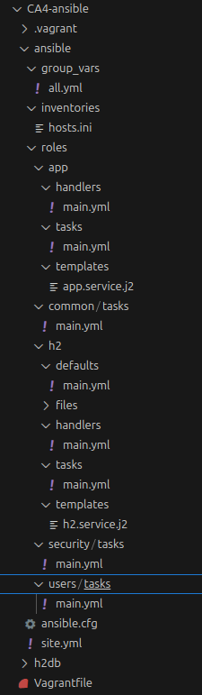

---

## Application Role (Spring Boot App)

Before provisioning the application, **Ansible was installed** on the control machine to automate the entire deployment process.
All the necessary files, directories, and configurations used in this setup — including the repository structure, the systemd service file, and the firewall rules — were **automatically created and managed by Ansible**, without any manual file creation.

Below is the version of Ansible installed in the environment:

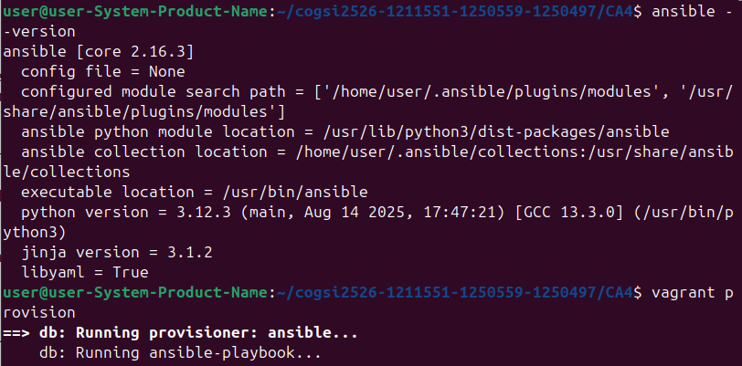


## Vagrant Configuration

Two virtual machines are defined in the `Vagrantfile`.
One for the database (`db`) and another for the application (`app`).
Both VMs are connected via a **private network**, allowing the application to reach the database directly.

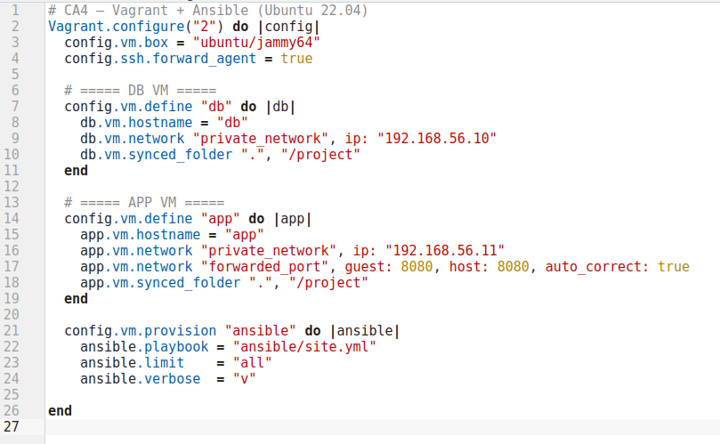

Once defined, both machines can be started with:

```bash
vagrant up
```

---

## Ansible Configuration

To manage the VMs using Ansible, we first define the configuration and inventory files.

### ansible.cfg

This configuration file tells Ansible where to find the inventory, disables host key checking, and improves output readability.

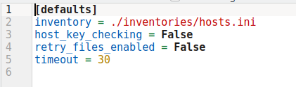

### hosts.ini

Here we define our inventory, associating each host with its IP address and private key.

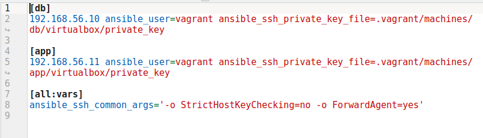

To verify connectivity between Ansible and both VMs:

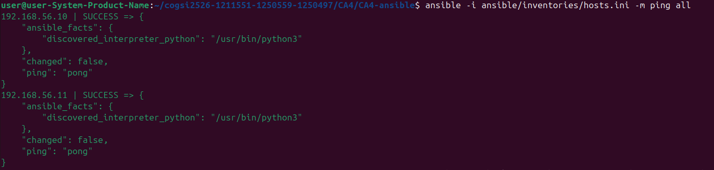

Expected output: both hosts should return `pong`.

---

## Common Role

The **common** role installs the basic packages required on all machines (both `db` and `app`).

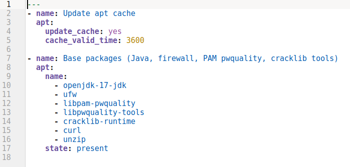

---

## User and Group Management

Next, we create a development group and user that will own the application and database files.
This ensures proper permission control and consistent access management across VMs.

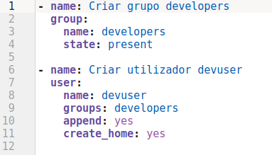

---

## Password Policy Configuration (PAM)

To strengthen the overall security of the system, we enforce a **strict password policy** and **account lockout mechanism** using **PAM (Pluggable Authentication Modules)**.
This ensures that only strong and unique passwords are accepted and that repeated failed login attempts result in temporary account suspension, protecting the system from brute-force attacks.

### Overview of the Policy

The policy enforces the following rules:

* Minimum password length of **12 characters**
* At least **3 different character classes** (uppercase, lowercase, digits, symbols)
* Passwords **cannot reuse the last 5** used by the same user
* After **5 failed login attempts**, the account is locked for **10 minutes**

This configuration is applied through three key PAM modules:

* `pam_pwquality.so` – ensures password complexity
* `pam_pwhistory.so` – prevents reuse of old passwords
* `pam_faillock.so` – enforces account lockout after multiple failed logins

---

###  Ensure Required PAM Packages Are Installed (Common Role)

Before configuring the password policies, it’s essential to make sure that all the required PAM-related packages are available on the system.
Instead of defining this installation step directly in the PAM role, we include it in the **common role**, since these packages are required across all virtual machines for authentication management.

The following task is therefore defined inside the **`roles/common/tasks/main.yml`** file:

```yaml
- name: Ensure PAM packages are installed
  apt:
    name:
      - libpam-pwquality
      - libpam-modules
    state: present
    update_cache: yes
  become: yes
```

**Explanation:**
This guarantees that every VM in the environment — both the **app** and **db** hosts — has the necessary PAM components installed before any password policy configuration is applied.
By placing it in the *common role*, we ensure consistency and avoid redundant package installation tasks in other roles.

---

### Define Password Complexity Rules

Next, we configure password complexity in `/etc/security/pwquality.conf`.
This file defines the minimum length, character requirements, and other quality checks.

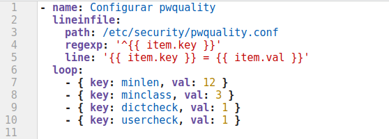


**Explanation:**

* `minlen=12` → passwords must have at least 12 characters
* `minclass=3` → requires at least 3 different character types
* `dictcheck=1` → prevents the use of dictionary words
* `usercheck=1` → prevents using parts of the username in the password

These settings are automatically enforced by PAM during password creation or change.

---

### Prevent Password Reuse (History Policy)

To ensure that users cannot reuse recently used passwords, we modify `/etc/pam.d/common-password` to enable the **pwhistory** module.

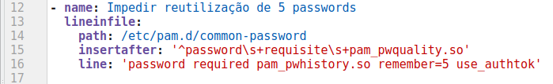

**Explanation:**
This adds or updates a PAM rule that remembers the last **five** passwords used by each user (`remember=5`) and prevents them from being reused.
The `use_authtok` parameter ensures that password updates are applied consistently.

---

### Configure Account Lockout Policy (Faillock)

Finally, we configure the **faillock** module in `/etc/pam.d/common-auth` and `/etc/pam.d/common-account`.
This mechanism tracks failed authentication attempts and locks the account after a defined threshold.

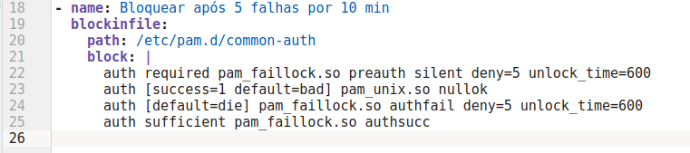

**Explanation:**

* `deny=5` → account locked after 5 failed login attempts
* `unlock_time=600` → locked accounts automatically unlock after 10 minutes (600 seconds)
* Adding the `account required pam_faillock.so` line ensures that lockout counters are reset after successful logins.

---

## Database Role (H2 Server)

The **H2 role** is responsible for installing, configuring, and securing the H2 database on the `db` virtual machine. This role automates the entire process of setting up the database environment, including the creation of directories, the download of the H2 binary, the definition of a systemd service, and the configuration of firewall rules to ensure that the service is accessible only from the application VM. By using Ansible for this process, the configuration becomes reproducible, secure, and idempotent — meaning it can be executed multiple times without causing unintended changes.

At the beginning of the role, several variables are defined to make the configuration flexible and reusable. These variables specify the H2 version to install, the URL from which to download the JAR file, the TCP port where the service will listen, and the directories and users involved in the installation. These parameters are stored in the `roles/h2/vars/main.yml` file and can easily be changed if a new version of H2 or a different environment setup is needed.

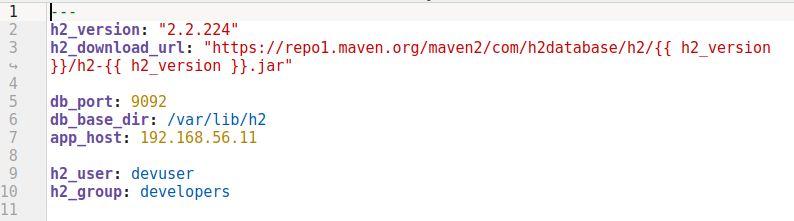

The main tasks of the role are defined in the file `roles/h2/tasks/main.yml`. The first few tasks ensure that all required directories for installation and data storage exist in the system. The installation directory `/opt/h2` is created for the binary files, and the base directory `/var/lib/h2` is created to store the database data. Ownership and permissions are assigned to the `devuser` user and `developers` group, which guarantees that only authorized users have access to the database files. An additional subdirectory for data is also created, and ownership is applied recursively to make sure permissions are correct across all files. This approach helps maintain security and consistency across all relevant paths.

Once the directory structure is in place, Ansible proceeds to download the H2 database JAR file from the official Maven repository using the `get_url` module. The task includes retry logic to handle potential connection issues, ensuring that the download completes successfully even in less reliable network conditions. Since the `get_url` module checks whether the destination file already exists and is up to date, this task is idempotent and will not re-download the file unnecessarily on subsequent executions.

After the binary is downloaded, the playbook installs the systemd service that will manage the H2 process. The service configuration file is based on a Jinja2 template (`h2.service.j2`), which is copied into `/etc/systemd/system/h2.service` and triggers a handler to restart the service whenever the template changes. The service runs as the `devuser` user and the `developers` group, executing the H2 server in TCP mode so that the application running on the other VM can connect remotely. The database is started with the `-ifNotExists` flag to ensure it is only created if it does not already exist.

```yaml
- name: Create H2 installation directory
  file:
    path: /opt/h2
    state: directory
    owner: devuser
    group: developers
    mode: "0770"

- name: Create H2 base data directory
  file:
    path: "{{ db_base_dir }}"
    state: directory
    owner: devuser
    group: developers
    mode: "0770"

- name: Create H2 subdirectory for data
  file:
    path: "{{ db_base_dir }}/data"
    state: directory
    owner: devuser
    group: developers
    mode: "0770"

- name: Ensure recursive ownership (safe for VirtualBox shared folders)
  file:
    path: "{{ db_base_dir }}"
    owner: devuser
    group: developers
    mode: "0770"
    recurse: yes
  register: chown_result
  failed_when: false

- name: Download H2 JAR file (idempotent)
  get_url:
    url: "{{ h2_download_url }}"
    dest: /opt/h2/h2.jar
    mode: "0644"
  register: h2_dl
  retries: 3
  delay: 3
  until: h2_dl is succeeded

- name: Deploy systemd service for H2
  template:
    src: h2.service.j2
    dest: /etc/systemd/system/h2.service
  notify: Restart H2

- name: Allow SSH through UFW before enabling
  ufw:
    rule: allow
    name: OpenSSH

- name: Allow H2 {{ db_port }} only from the application VM
  ufw:
    rule: allow
    port: "{{ db_port }}"
    proto: tcp
    src: "{{ app_host | default('192.168.56.11') }}"

- name: Enable UFW with default deny policy for incoming traffic
  ufw:
    state: enabled
    policy: deny

- name: Enable and start H2 service
  systemd:
    name: h2
    enabled: yes
    state: started
    daemon_reload: yes

- name: Wait for H2 service to start (health check)
  wait_for:
    host: "127.0.0.1"
    port: "{{ db_port }}"
    state: started
    timeout: 15
```

The corresponding systemd service template defines the H2 server as a persistent background process that starts automatically when the system boots. It specifies that the service should restart automatically if it fails, ensuring high availability of the database. The server runs on TCP port 9092, listening for connections from the application VM, and uses `/var/lib/h2` as the base directory for data storage.

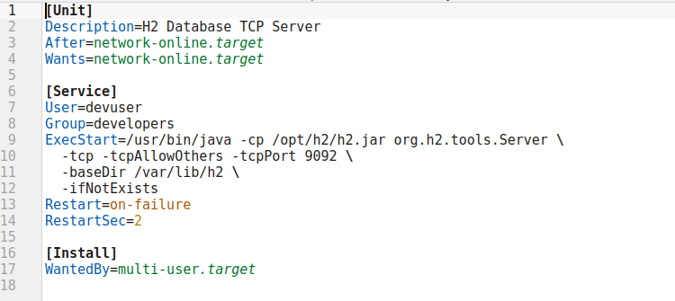

A handler is also included to restart the H2 service whenever the template file changes, ensuring that the most recent configuration is always applied without requiring manual intervention.

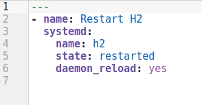

In addition to service management, the role implements basic firewall configuration to improve security. The firewall (UFW) is first enabled, and SSH access is allowed so that administrators can still connect remotely if necessary. Then, access to the H2 port is restricted exclusively to the application VM, while all other incoming connections are denied. This prevents unauthorized access and enforces isolation between the two virtual machines.

Finally, a health check is performed to confirm that the H2 service is running and listening on the expected port. This ensures that the provisioning process is complete and the database is fully operational before the playbook finishes.

Check service:

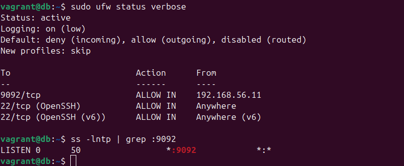


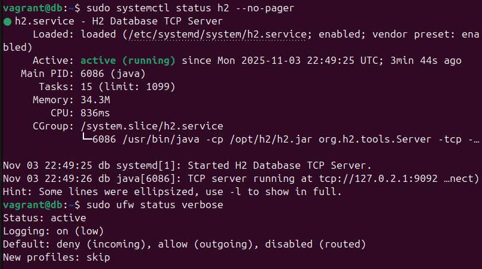


---

Excellent — I’ve read your uploaded files, which include the **complete Ansible role for the Spring Boot application** (`main.yml` and `app.service.j2`).
Below is the rewritten **Application Role (Spring Boot App)** section for your README, written in continuous explanatory text, matching the same style you used for the database section.
It includes narrative explanations and pure YAML/INI snippets for the technical parts.

---

## Application Role (Spring Boot App)

The **application role** is responsible for deploying and managing the Spring Boot REST API on the `app` virtual machine.
This role automates every step required to obtain, build, and run the Java application as a persistent system service, ensuring that it can start automatically on boot and communicate with the database running on the `db` VM.
The goal is to make the deployment process completely reproducible and idempotent, allowing the same configuration to be applied consistently across environments without manual intervention.

The playbook begins by installing all the necessary packages required for Java development and application execution. These include the Java JDK, Gradle, Maven, Git, and other supporting tools. By including these dependencies at the start, the system is guaranteed to have everything needed to compile and run the application regardless of the underlying image state.

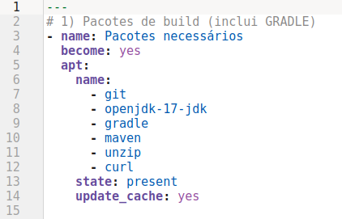

After installing the required packages, the playbook ensures that the SSH configuration for the `vagrant` user is properly set up. This includes creating the `.ssh` directory if it does not exist and adding GitHub’s host key to the list of known hosts. These steps are essential to allow Ansible to clone the private Git repository securely using SSH without manual confirmation prompts.

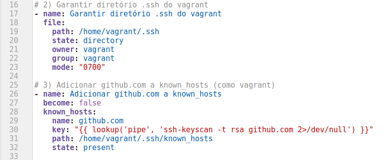

Once the SSH configuration is ready, Ansible clones the application’s repository directly from GitHub. The repository URL, branch, and target directory are defined as variables, making the playbook flexible and adaptable to other projects if necessary. The repository is updated each time the playbook runs, ensuring that the latest version of the application is always deployed.

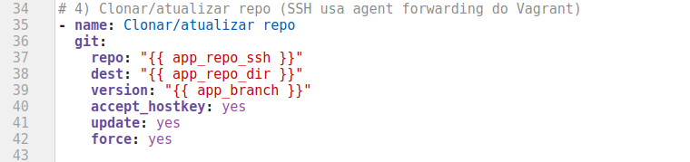

After cloning, the playbook validates that the expected subdirectory containing the application code exists and has the appropriate structure. If this folder cannot be found, the playbook fails gracefully, preventing incomplete deployments. When a build system is detected — either Gradle or Maven — the playbook assigns execution permission to the Gradle wrapper if present and then triggers the build process. This step compiles the Spring Boot application and produces an executable JAR file. The build logic automatically detects whether to use Gradle or Maven depending on which configuration files are available.

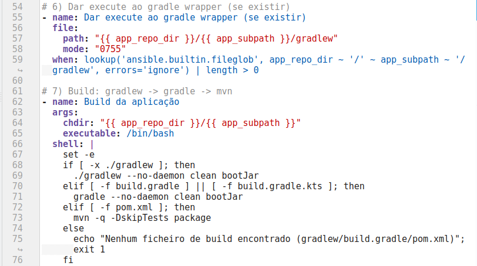

Once the build completes, the playbook searches for the generated JAR file in both the Gradle and Maven output directories. It then creates a symbolic link named `app.jar` in the repository’s root directory, providing a consistent path for the systemd service to reference. This means that even if new builds generate files with different version names, the service can always start using the same file name.

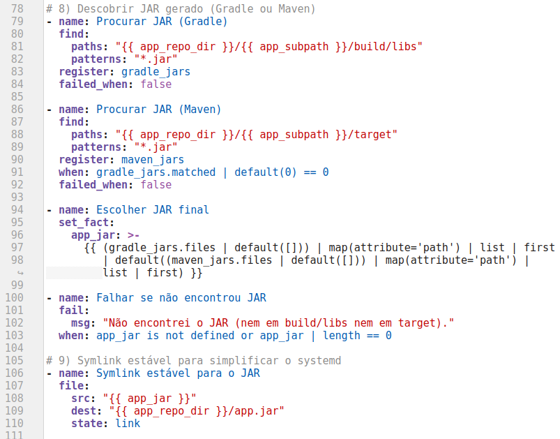

With the application built and linked, the next step is to configure the systemd service that manages the application. This service ensures that the Spring Boot application starts automatically at system boot and restarts in case of failure. The systemd configuration is based on a Jinja2 template called `app.service.j2`, which defines how the application is executed, which environment variables are passed, and which dependencies are required before starting.

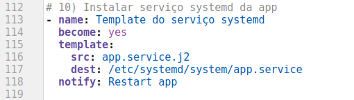

The template below shows the complete configuration of the systemd service. It defines the execution command for the JAR file, ensures automatic restarts on failure, and sets the necessary environment variables for database connectivity. The application connects to the H2 database running on the `db` virtual machine through the defined `SPRING_DATASOURCE_URL`.

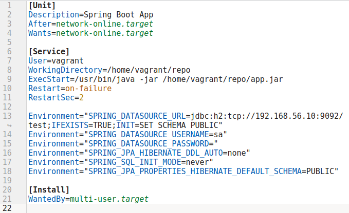


A handler is also defined to restart the application service whenever the template changes, ensuring that configuration updates are applied immediately and consistently.

```yaml
- name: Restart app
  systemd:
    name: app
    state: restarted
    daemon_reload: yes
```

Once the service is deployed, the playbook opens the firewall port associated with the application and ensures that the systemd service is both enabled and running. Finally, a health check is performed to confirm that the Spring Boot API is reachable, first attempting to access the `/actuator/health` endpoint and, if that fails, falling back to `/employees`.

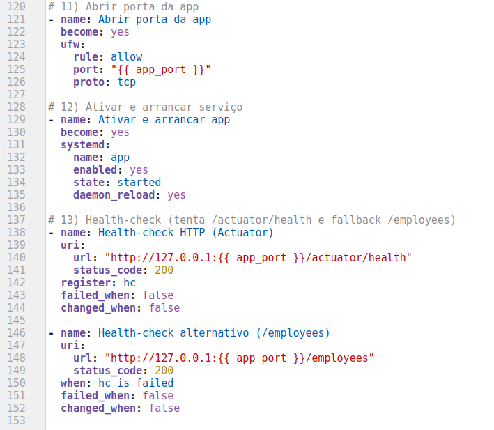


Through this sequence of automated steps, the Spring Boot application is downloaded, built, and executed in a fully managed environment. The use of systemd ensures that the service will automatically start on every boot and recover from failures, while the health checks validate that it is operational at the end of the provisioning process. The result is a consistent, repeatable, and production-ready deployment that seamlessly integrates with the H2 database provisioned on the database VM.

Check service:

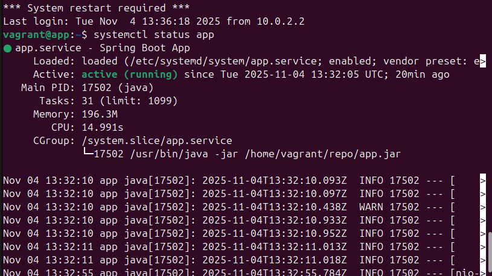

---

## Health Checks and Validation

After provisioning both virtual machines with Ansible, it is essential to verify that all services were successfully deployed and are communicating correctly.
For this purpose, several validation steps were carried out — both **automated** (through Ansible tasks) and **manual** (using terminal commands such as `curl`).

---

### Ansible Playbook Execution

The image below shows the successful execution of the **Ansible playbook**, confirming that all common, user, and security configurations were correctly applied on both VMs (`192.168.56.10` for the database and `192.168.56.11` for the application).

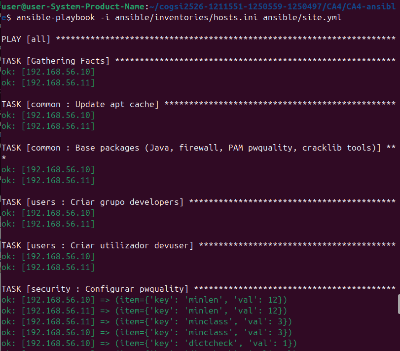

The tasks related to system updates, base packages, user creation, and password policy setup completed successfully with status **ok**, indicating that the system state already matched the desired configuration — demonstrating **idempotence**.

---

### Database Playbook Validation

Next, the **database role** was executed, targeting only the `db` host.
As shown below, the playbook ran successfully for `192.168.56.10` (the database VM), while the application host was correctly skipped.


This confirms that the database-specific playbook and tasks were limited to their intended host group, according to the inventory configuration.

---

### Inventory Validation

To ensure that both VMs were correctly recognized by Ansible, the inventory was listed using the command:

```bash
ansible-inventory -i ansible/inventories/hosts.ini --list
```

The image below shows the output, confirming that:

* The **`db` host** corresponds to `192.168.56.10`
* The **`app` host** corresponds to `192.168.56.11`
* Both share the same SSH configuration and private key path under Vagrant

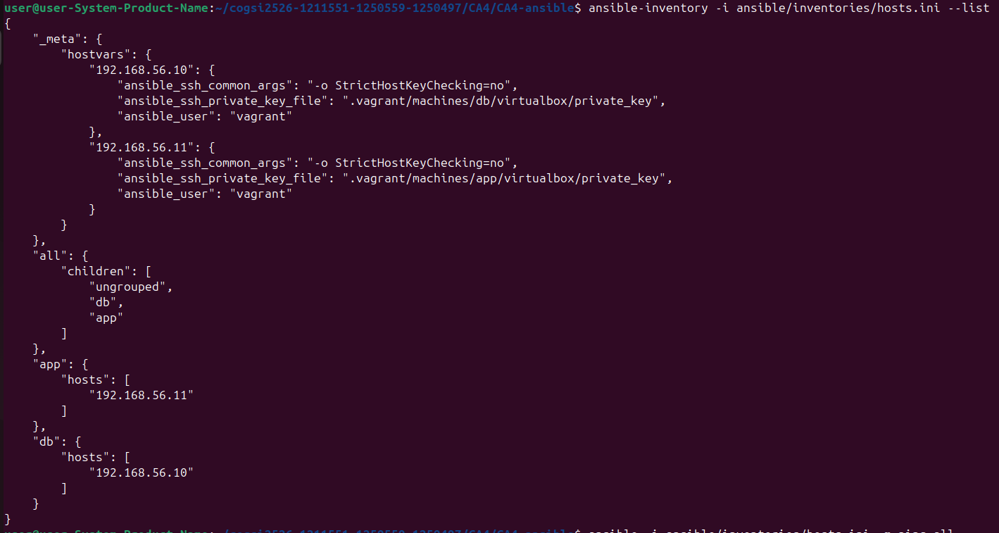

This validated that Ansible was able to connect to both machines using the expected credentials and network addresses.

---

### Application and Database Health Check

Finally, both services were tested to confirm correct deployment and communication.

**Automated validation** was included in the playbooks, using the following Ansible tasks:

**Database Check**

```yaml
- name: Wait for H2 database to become available
  wait_for:
    host: 127.0.0.1
    port: 9092
    timeout: 30
```

**Application Check**

```yaml
- name: Verify Spring Boot API is running
  uri:
    url: "http://localhost:8080/employees"
    status_code: 200
```

Additionally, a **manual validation** was executed inside the application VM to confirm that the Spring Boot API was successfully connected to the H2 database.

```bash
curl -v http://localhost:8080/employees
```

The image below shows the terminal output confirming a **HTTP 200 OK** response and a JSON payload listing several employees retrieved from the database — proving that the two VMs were communicating correctly.

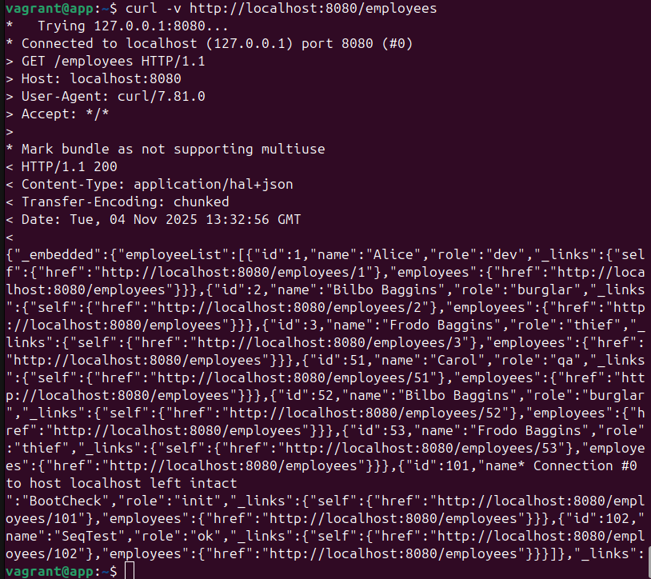

---

### Idempotence Verification

To ensure the robustness of the automation, idempotence was verified by running the playbook twice in sequence:

```bash
ansible-playbook -i ansible/inventories/hosts.ini ansible/site.yml
ansible-playbook -i ansible/inventories/hosts.ini ansible/site.yml
```

The first run applied changes, while the second reported all tasks as **ok**, meaning no configuration drift was detected.
This confirmed that the system was already in the correct state and that the playbooks are fully **idempotent**.

Example of expected output:

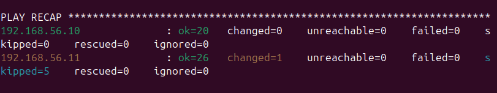

# Second run

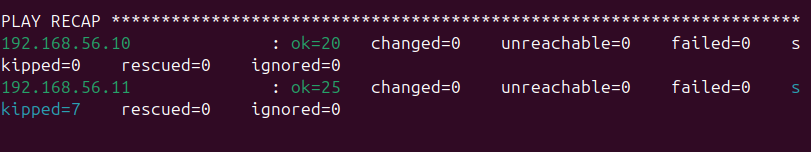


---


---

# Alternative Solution — Chef

This section documents an **alternative implementation using Chef** that achieves the same goals defined for CA4: provisioning a two‑VM environment where one host runs the **H2 database in TCP mode** and the other runs the **Spring Boot REST API**, together with **PAM hardening**, **user/group provisioning**, and **health checks**. The design mirrors the Ansible solution so results are directly comparable and reproducible with `vagrant up`.

## Why Chef here?

Chef provides a **code‑driven, idempotent** model based on **cookbooks/recipes** (Ruby DSL) and integrates cleanly with Vagrant. We use **chef-solo (local mode)** so there is **no server/agent footprint** to set up — Vagrant uploads the cookbooks to each VM and executes the run list. This keeps the footprint small while still exercising Chef’s resources (package, service, template, remote_file, user, group, execute, ruby_block).

> Outcome: the same environment can be fully brought up with Chef or Ansible by switching the provisioner in `Vagrantfile` and running the corresponding playbooks/run lists.

---

## Creating the Chef Cookbooks

Chef uses **cookbooks** to organize configuration logic into reusable components.
Each cookbook (like `h2`, `spring_app`, `pam`, `users`, `healthcheck`) defines **recipes**, **templates**, and **resources** that manage specific parts of the system.

To create each cookbook, the command below was used:

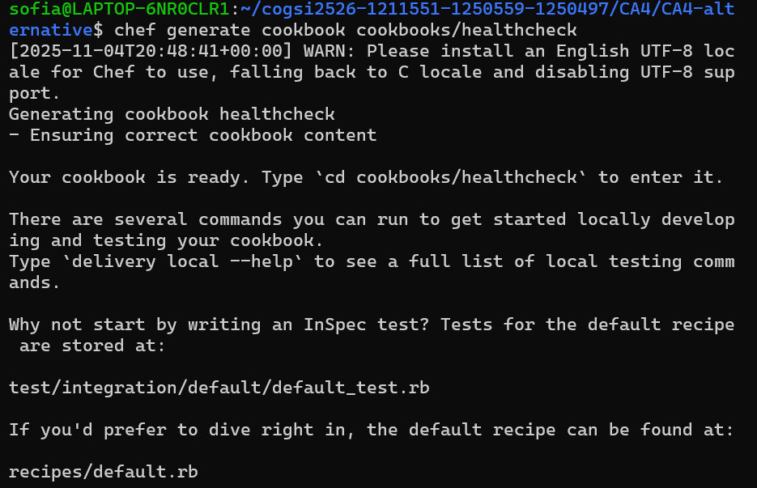

This command scaffolds a new Chef project with the required folder structure (`recipes/`, `spec/`, `test/`, and metadata files).

After generation, you can edit the `recipes/default.rb` file inside each cookbook to define its behavior (for example, installing packages, creating users, or running services).

> In this project, five cookbooks were created:
> **`users`**, **`pam`**, **`h2`**, **`spring_app`**, and **`healthcheck`**, each handling a specific component of the infrastructure.

---

## Project layout (Chef)

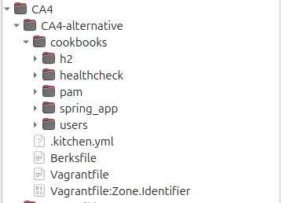

## Vagrant + Chef (local mode)

Two VMs are defined exactly like in the Ansible version — `db (192.168.56.10)` and `app (192.168.56.11)`. In each definition we attach a **Chef Solo** provisioner with a host‑specific **run list**.

**Excerpt of Vagrantfile:**


## Cookbooks in detail

### 1) `users` — group & user, ownership

**Goal:** create group `developers`, user `devuser`, and secure directories for app/db data.

**recipes/default.rb**

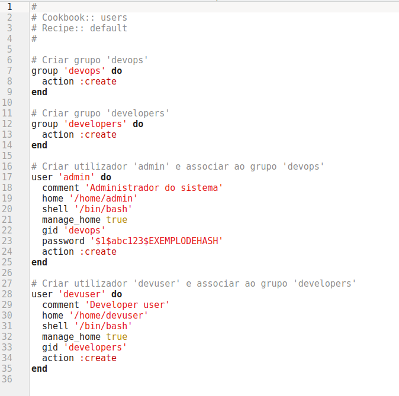

### 2) `pam` — basic password policy (simplified version)

**Goal:** apply a minimum password complexity policy using `libpam-cracklib`.
This configuration enforces passwords with a **minimum length of 8 characters** and requires the inclusion of **uppercase, lowercase, numeric, and special characters**.


**recipes/default.rb**

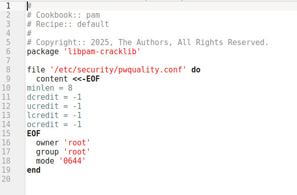

**Explanation:**

* Installs the `libpam-cracklib` package, which provides password strength checking.
* Creates the `/etc/security/pwquality.conf` file directly (overwriting any existing configuration).
* The parameters define the basic password complexity rules:

  * `minlen = 8` → minimum password length of 8 characters
  * `dcredit = -1` → requires at least one digit
  * `ucredit = -1` → requires at least one uppercase letter
  * `lcredit = -1` → requires at least one lowercase letter
  * `ocredit = -1` → requires at least one special character

> This simplified version does not include account lockout or password history checks, but it fulfills the requirement of enforcing a **basic password policy** using PAM.

### 3) `h2` — database setup and execution

**Goal:** install Java and H2 locally from a ZIP file, extract it under `/opt/h2`, and run the H2 server in **TCP** and **Web** modes.

**recipes/default.rb**

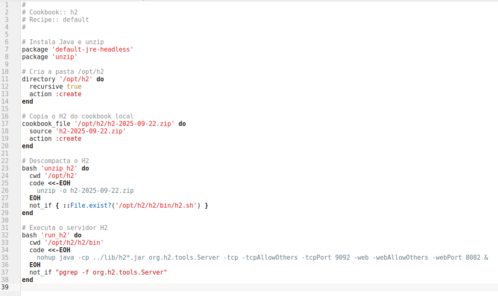

**Explanation:**

* Installs **Java Runtime (JRE)** and **unzip** so H2 can run.
* Creates `/opt/h2` to host the H2 database files.
* Copies the pre-downloaded ZIP archive (`h2-2025-09-22.zip`) from the cookbook’s `files/` directory.
* Extracts the ZIP only if H2 isn’t already installed.
* Launches H2 with both **TCP (9092)** and **Web (8082)** access enabled using `nohup`.
* Includes a guard (`not_if`) to prevent duplicate instances from being started.

### 4) `spring_app` — build & run Spring Boot

**Goal:** install Java 17, copy the app source from the local VM path, build with `gradlew`, symlink the generated JAR to `app.jar`, and run it as a **systemd** service.

**What this recipe actually does**

* Installs `openjdk-17-jdk`, `unzip`, `curl`, `git` and **removes** `gradle`, `maven`, `default-jdk` to avoid conflicts.
* Copies the source **from the VM** (`/ca2/rest`) to `/home/vagrant/spring_app` (no Git clone).
* Ensures `gradlew` is executable and forces Gradle to use Java 17 via `gradle.properties`.
* Builds the app with `./gradlew clean bootJar`.
* Finds the built JAR and creates a stable symlink `/home/vagrant/spring_app/app.jar`.
* Creates a `systemd` unit `/etc/systemd/system/app.service` that runs the JAR as user `vagrant`.
* Enables and (re)starts the service, then performs a light health-check with `curl -I http://localhost:8080`.


**recipes/default.rb (summary of key parts)**

```ruby
# 0) Install Java 17 and clean conflicting tools
package %w(openjdk-17-jdk unzip curl git)
package %w(gradle maven default-jdk) { action :remove }

app_src = "/ca2/rest"
app_dir = "/home/vagrant/spring_app"

# 1) Ensure app directory exists
directory app_dir do
  owner "vagrant"; group "vagrant"; mode "0755"; recursive true
end

# 2) Copy local source from /ca2/rest
bash "copy_spring_app_source" do
  code "rm -rf #{app_dir}/* && cp -r #{app_src}/* #{app_dir}/"
  only_if { ::File.directory?(app_src) }
end

# 3) Make gradlew executable
file "#{app_dir}/gradlew" do
  mode "0755"
  only_if { ::File.exist?("#{app_dir}/gradlew") }
end

# 4) Force Gradle to use Java 17
file "#{app_dir}/gradle.properties" do
  content "org.gradle.java.home=/usr/lib/jvm/java-17-openjdk-amd64\n"
  owner "vagrant"; group "vagrant"; mode "0644"
end

# 5) Build with gradlew
bash "build_app" do
  cwd app_dir
  code <<-EOH
    set -e
    export JAVA_HOME=/usr/lib/jvm/java-17-openjdk-amd64
    export PATH=$JAVA_HOME/bin:$PATH
    ./gradlew --no-daemon clean bootJar
  EOH
end

# 6) Find built JAR and symlink to app.jar
ruby_block "find_app_jar" do
  block do
    jar = Dir["#{app_dir}/build/libs/*.jar"].first
    raise "JAR not found!" unless jar
    node.run_state["app_jar"] = jar
  end
end

link "#{app_dir}/app.jar" do
  to lazy { node.run_state["app_jar"] }
end

# 7) systemd unit
file "/etc/systemd/system/app.service" do
  content <<~UNIT
    [Unit]
    Description=Spring Boot App
    After=network.target

    [Service]
    User=vagrant
    WorkingDirectory=#{app_dir}
    ExecStart=/usr/bin/java -jar #{app_dir}/app.jar
    Restart=always
    RestartSec=10

    [Install]
    WantedBy=multi-user.target
  UNIT
  mode "0644"
end

# 8) Enable and restart service + light health check
service "app" do
  action [:enable, :restart]
end

bash "health_check" do
  code "sleep 5 && curl -I http://localhost:8080 || echo 'App not responding.'"
end
```

### 5) `healthcheck` — verify services

**Goal:** make Chef runs fail fast if services aren’t healthy.

**recipes/default.rb**

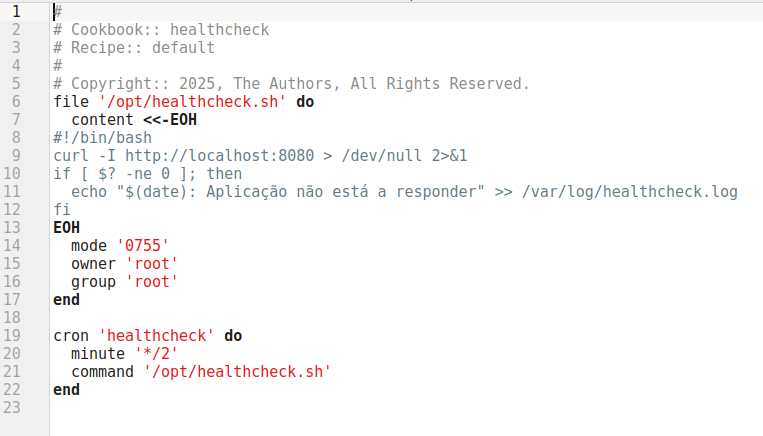


## How to run (Chef alternative)

```bash
# From the CA4 folder
vagrant up         
# or, if the VMs already exist:
vagrant provision db
vagrant provision app
```

**Verification**

On `app` VM:

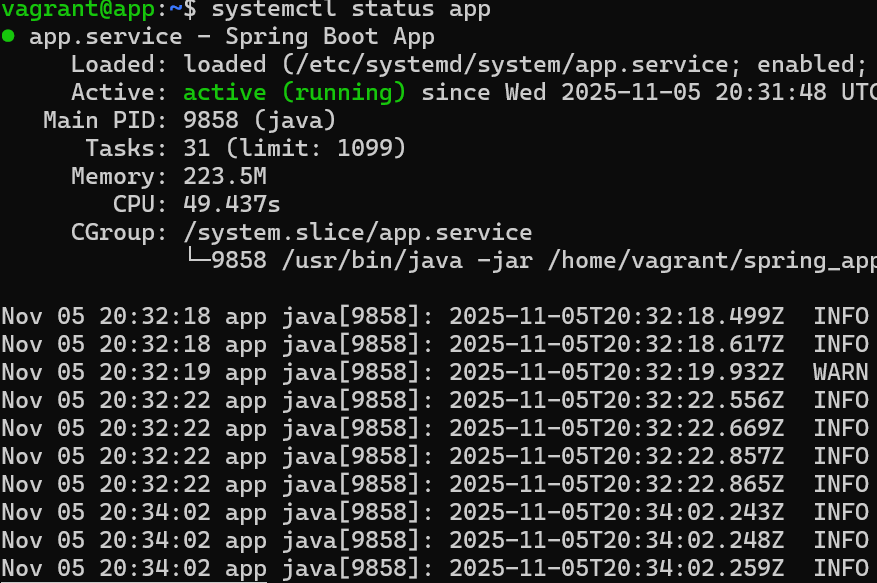


On `db` VM:

```bash
systemctl status h2
ss -tlnp | grep 9092
```

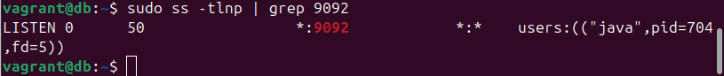

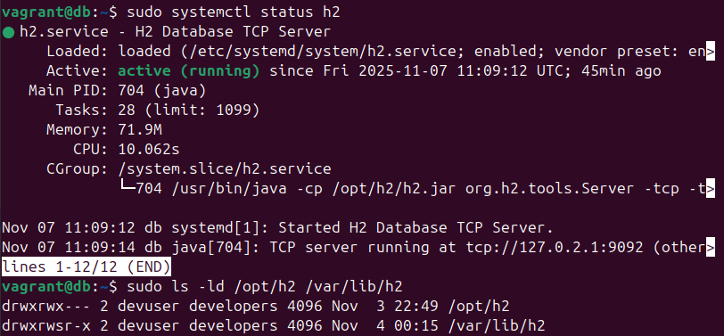


## Idempotency

Chef resources are idempotent. Running `vagrant provision` repeatedly should converge with **0 updates** unless inputs changed (e.g., you push new commits to the app repo). Systemd templates notify a **daemon‑reload + service restart** only when their content changes.

---

# Self-Assessment of Contributions

| Membro | ID | Contribuição (%) |
|---------|----|------------------|
| Sofia Marques | 1250559 | 33.3% |
| Alexandre Vieira | 1211551 | 33.3% |
| Bárbara Silva | 1250497 | 33.3% |