# **CA5 – Containerization and Orchestration (Docker)**

## **Objectives**

The objective of this assignment is to understand and apply modern containerization technologies, focusing on **Docker**, and to compare its use with alternative container engines.

CA5 is divided into **two main parts and one alternative**:

* **Part 1:** Containerization of the applications developed in CA2/CA3, including the creation of Docker images (v1, v2, and multi-stage builds) and validation of containerized execution.

* **Part 2:** Deployment and orchestration of a multi-container environment (e.g., using Docker Compose), enabling coordinated execution and networking between services.

* **Alternative:** Implementation and analysis of an equivalent solution using another containerization or runtime tool as an alternative to Docker.

---

# Comparative Analysis: Docker and Containerization Alternatives

Modern application deployment relies heavily on **containerization**, and Docker has become the most widely adopted tool in this space.
However, several alternatives provide different architectures, features, and use cases.
This section provides an in-depth comparison between **Docker**, **Podman**, **containerd**, **CRI-O**, and **LXC/LXD**, examining how they differ in design, security, ecosystem, and typical scenarios.

---

# Docker

**Docker** is the most popular containerization platform, providing tools for building, running, and distributing containers.
Docker introduced a developer-friendly workflow, an opinionated ecosystem (Docker Engine, Docker CLI, Docker Compose, Docker Hub), and made containers mainstream.

Docker uses a **daemon-based architecture**, where the Docker Engine performs all container operations on behalf of the user.

### **Advantages:**

* Extremely **easy to use**, both for beginners and experts.
* Massive ecosystem: **Docker Hub**, Docker Compose, Docker Desktop.
* Strong community support and documentation.
* Works across Linux, macOS, and Windows.
* Integrates well with CI/CD systems and cloud providers.
* Mature tooling for building and distributing containerized applications.

### **Shortcomings:**

* Requires a **daemon running as root**, which may raise security concerns.
* Docker Engine is **not part of the Kubernetes CRI (Container Runtime Interface)**—Kubernetes now uses containerd/CRI-O by default.
* Memory and CPU usage can be higher compared to lightweight runtimes.
* Less suitable for extremely minimal or security-sensitive environments.

Docker remains the **de facto standard for development and testing**, and is widely used for local development, microservices, and DevOps workflows.

---

# Podman

**Podman** is a daemonless container engine developed by Red Hat.
It is compatible with Docker’s CLI (`podman run`, `podman build`, etc.) and can even alias as Docker.

Podman’s biggest distinction is its **rootless architecture**, which enhances security by eliminating the need for a privileged daemon.

### **Advantages:**

* **Daemonless and rootless**, providing a more secure environment.
* Supports **Docker-compatible commands and images**.
* Can manage “pods” natively, similar to Kubernetes.
* Integrates well with systemd for persistent services.
* Lighter footprint and improved security isolation.

### **Shortcomings:**

* Slightly steeper learning curve for users used to Docker’s workflows.
* Podman Compose (alternative to Docker Compose) is less mature.
* Smaller community compared to Docker.
* Less widespread adoption in non-Red Hat ecosystems.

Podman is ideal for **production servers**, **security-focused environments**, or when Docker’s root daemon is undesirable.

---

# containerd

**containerd** is a lightweight, high-performance runtime originally extracted from Docker.
It focuses solely on running containers and managing images, without orchestration or higher-level features.

Kubernetes uses containerd as its default runtime.

### **Advantages:**

* Very lightweight and optimized for performance.
* Directly compliant with the **Kubernetes CRI**.
* Mature, minimal, stable — ideal for cloud-native environments.
* Used internally by Docker itself.

### **Shortcomings:**

* Not intended for developers — lacks build tools, high-level CLI, or Compose-like features.
* Typically requires an orchestration layer to be useful (Kubernetes).

containerd is best suited for **Kubernetes clusters**, managed environments, or minimal container runtime setups.

---

# CRI-O

**CRI-O** is an OCI-compliant runtime purpose-built for Kubernetes.
It is extremely lightweight and secure, designed only to meet Kubernetes CRI requirements.

### **Advantages:**

* Minimal footprint — no unnecessary features.
* Highly secure and stable, widely used in enterprise Kubernetes distributions.
* Works seamlessly with Kubernetes without extra abstractions.

### **Shortcomings:**

* Not designed for Docker-like development workflows.
* Limited outside Kubernetes use cases.

CRI-O is the best choice for **production Kubernetes clusters**, especially in Red Hat/OpenShift environments.

---

# LXC / LXD

**LXC (Linux Containers)** and **LXD** provide OS-level virtualization, closer to lightweight virtual machines than application containers.

LXD provides a user-friendly interface on top of LXC, allowing full system containers.

### **Advantages:**

* Runs **full Linux OS containers**, not just applications.
* Better suited for system-level isolation or VM replacement.
* Strong networking and storage management capabilities.

### **Shortcomings:**

* Heavier than Docker-style containerization.
* Not meant for microservices or app-level deployment.
* Smaller community and ecosystem.

LXC/LXD is ideal for **system containers**, hosting multiple Linux OS instances, or replacing VMs with lightweight environments.

---

# Comparison Summary Table (sem coluna de estrelas)

| Tool           | Architecture       | Rootless | Kubernetes Support        | Best Use Case                                  | Notes                        |
| -------------- | ------------------ | -------- | ------------------------- | ---------------------------------------------- | ---------------------------- |
| **Docker**     | Daemon-based       | Partial  | Indirect (via containerd) | Development, CI/CD, microservices              | Easiest + largest ecosystem  |
| **Podman**     | Daemonless         | Yes      | Medium                    | Secure production servers, rootless containers | Docker-compatible            |
| **containerd** | Runtime-only       | Yes      | Native                    | Kubernetes clusters, cloud-native runtime      | Very lightweight             |
| **CRI-O**      | Runtime-only (K8s) | Yes      | Native                    | Enterprise Kubernetes deployments              | Purpose-built for Kubernetes |
| **LXC/LXD**    | System containers  | Yes      | Low                       | OS virtualization, VM replacement              | Full OS containers           |

---

# CA5 Part 1

## **Chat Application — Docker v1**

This document explains all the steps performed to run the chat server inside a Docker container, including the project structure, the Dockerfile, the commands used, and the technical issues encountered and solved during the process.

---

# Project Structure

The Part 1 folder contains two sub-directories:

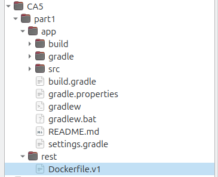


The **`app`** folder contains the source code located in `src/main/java/basic_demo/...`, along with the Gradle configuration files (`build.gradle` and `settings.gradle`) and the Gradle Wrapper (`gradlew` and `gradlew.bat`).
The **`rest`** folder includes the `Dockerfile.v1` file, which is the Dockerfile used for the first version of the chat server container.


---

# Dockerfile.v1

The `Dockerfile.v1`, placed in `CA5/part1/rest/`, contains:

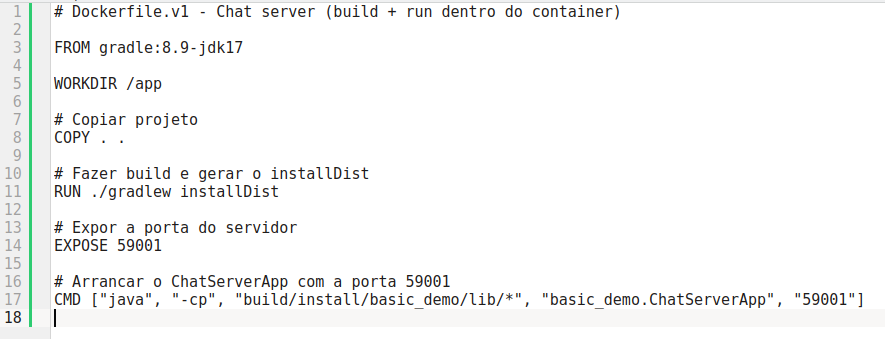

---

# Building the Docker Image

Within the `CA5/part1/` folder, we executed the command below:


The option -f rest/Dockerfile.v1 tells Docker that the Dockerfile is located inside the rest/ directory. The app parameter sets the build context, which makes Docker copy the Java project into the container during the build process.

The image below shows that it built successfully:

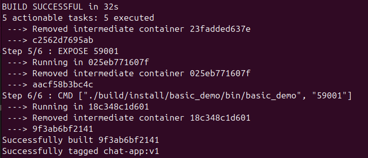

---

# Running the Chat Server in Docker

Command:

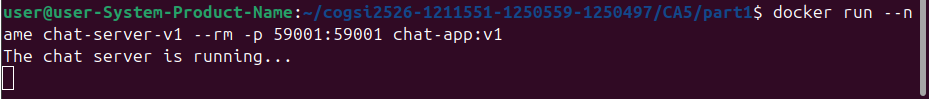

After executing the command, Docker starts the container, launches the chat server automatically, and displays the message “The chat server is running...” in the terminal. This confirms that the container initialized correctly, the server started as expected, and the port mapping (59001:59001) is properly configured, allowing the server to be accessed from the host machine. Overall, it demonstrates that the Docker image was built correctly and that the application is functioning as intended inside the container.

---

# Testing the Client (on the host)

The client requires **Java 17** to run correctly, since the GUI (Swing) does not work properly with newer default JDK versions on some systems. 


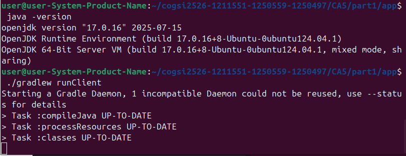


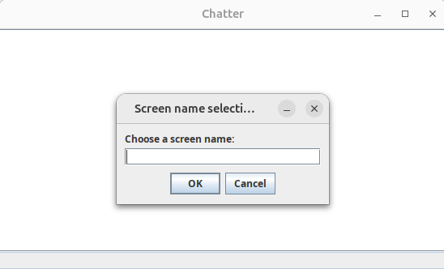


The graphical window appeared, allowing:

* entering a screen name
* sending/receiving messages
* connecting to the server running inside Docker

---

# Additional Server Test (without GUI)

To further verify that the server was running correctly inside the Docker container, an additional test was performed from a separate terminal. By running the command nc localhost 59001, a manual connection was opened to the server’s exposed port. The server immediately responded with the expected prompt (SUBMITNAME), and after sending a username, it accepted the input, confirming that the connection was successfully established.

To confirm the server was listening:

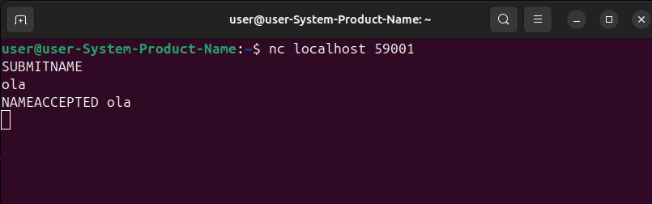

This behaviour is also reflected in the Docker container’s output, where the server logs show that a new user has joined and the message sent from the external terminal is received correctly.

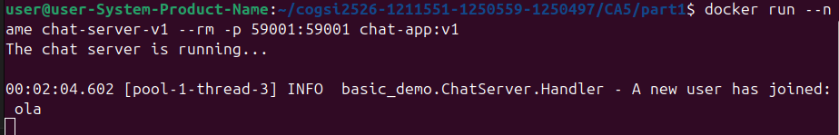

Meaning the Docker container’s server is fully functional.

---

# Spring Boot REST API with Docker

## Overview

The objective of this part is to containerize the Spring Boot REST API developed previously using **three different Docker approaches**:

1. **Version 1 – Build inside the container (Gradle image)**
2. **Version 2 – Host-built JAR + minimal runtime image**
3. **Version 3 – Multi-stage build (recommended)**

Each version demonstrates a different Docker containerization strategy, from simple development builds to optimized production-ready images.

---

# Application Structure

This Spring Boot REST application is located at:

```
CA5/part1/CA2-part2/rest
```

It contains:

* `build.gradle`
* `src/main/...`
* `build/libs/rest-0.0.1-SNAPSHOT.jar`
* Three Dockerfiles:

  * `dockerfile-spring-app` (v1)
  * `dockerfile-spring` (v2)
  * `dockerfile-multi-stage` (v3)

---

# Version 1 – Build inside container (Gradle Image)

### Dockerfile: `dockerfile-spring-app`

This version uses a **Gradle + JDK image** and builds the project *inside* the container.

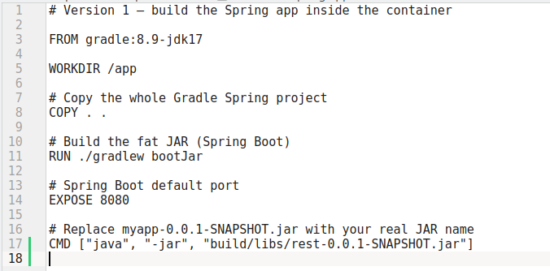

### Build & Run

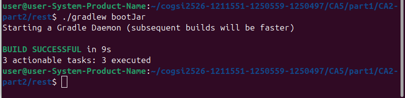

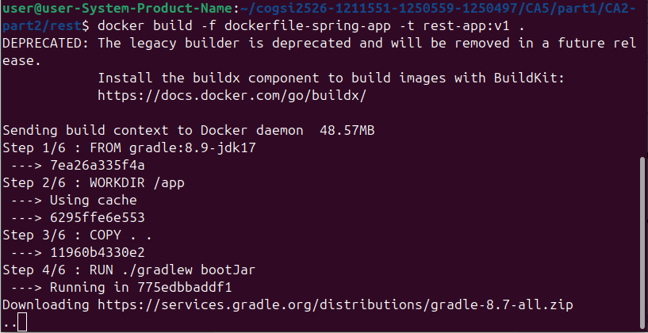

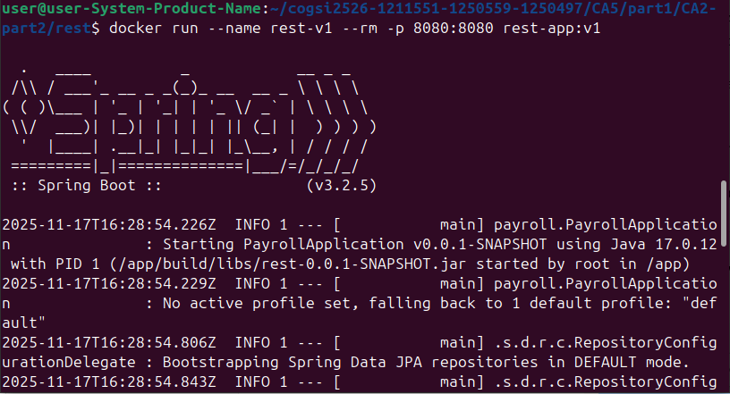


### Pros / Cons

| Pros                         | Cons                                                 |
| ---------------------------- | ---------------------------------------------------- |
| Very easy setup              | Image is large (includes Gradle + JDK + source code) |
| Good for development         | Slow build time                                      |
| No need to build JAR on host | Not production friendly                              |

---

# Version 2 – Host-built JAR + minimal runtime

### Dockerfile: `dockerfile-spring`

This version uses a **JRE-only image** and copies the JAR previously built on the host.

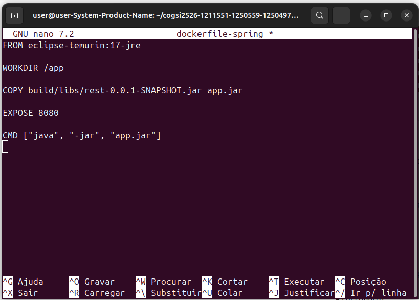

### Build & Run

Build the JAR first:

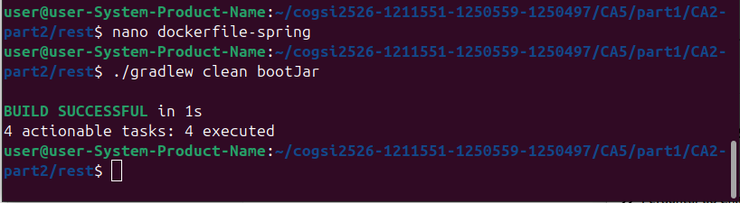

Then build the image:

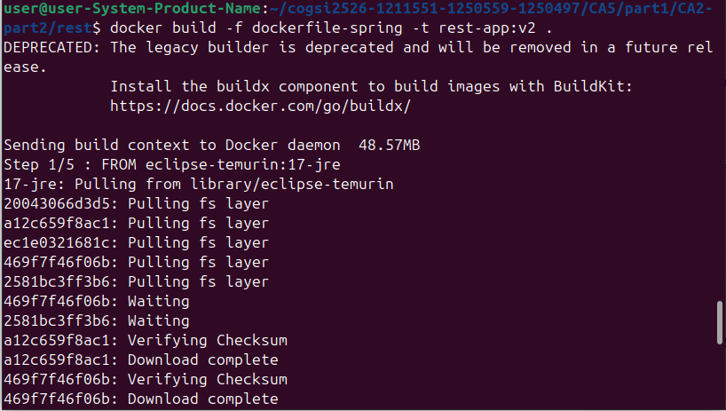

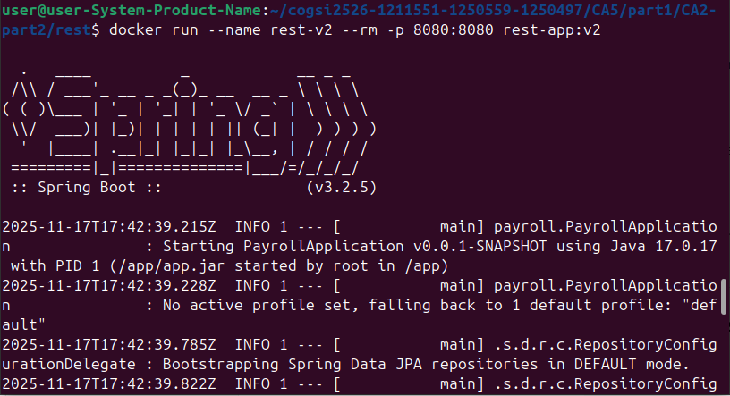

### Pros / Cons

| Pros                      | Cons                          |
| ------------------------- | ----------------------------- |
| Much smaller image        | Requires building JAR on host |
| Faster startup            | More manual steps             |
| Only contains runtime JRE | Less automated                |

---

# Version 3 – Multi-stage Build (Optimized)

### Dockerfile: `dockerfile-multi-stage`

This method builds the JAR in one stage and copies only the final artifact to a minimal image.

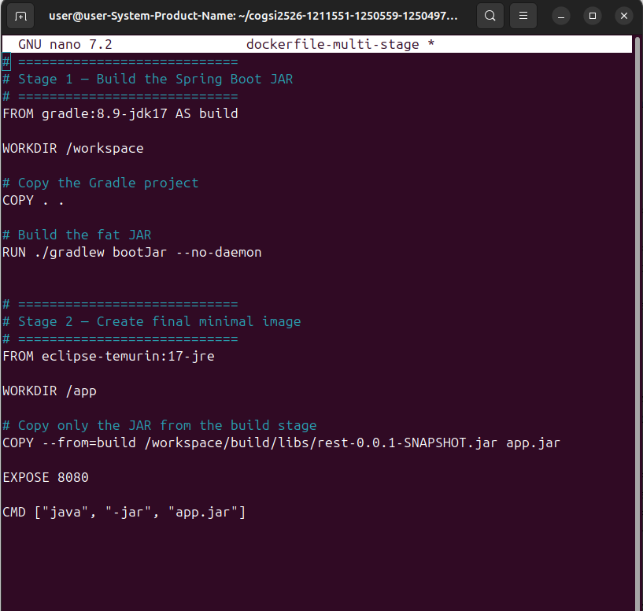

### Build & Run

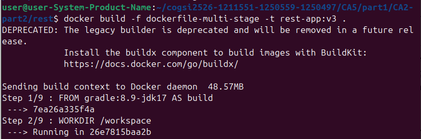

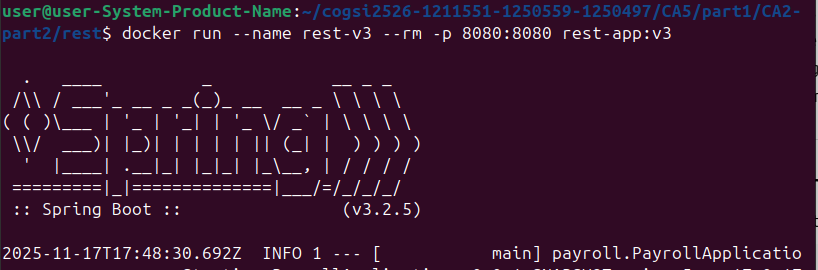

### Pros / Cons

| Pros                          | Cons                                      |
| ----------------------------- | ----------------------------------------- |
| Smallest and fastest image | Slightly more complex Dockerfile          |
| Production-ready              | Requires understanding multi-stage builds |
| No Gradle/JDK in final image  | —                                         |
| Cleanest & safest approach    | —                                         |

---

# Comparison Summary

| Version | Build Method           | Image Size | Speed     | Recommended For      |
| ------- | ---------------------- | ---------- | --------- | -------------------- |
| **v1**  | Build inside container | Largest  | Slowest | Development, testing |
| **v2**  | Build on host          | Medium  | Faster | Simpler workflows    |
| **v3**  | Multi-stage            | Smallest | Fastest | **Production**       |

---

# Testing the API

After running any version:

```bash
curl http://localhost:8080/employees
```

Or open in browser:

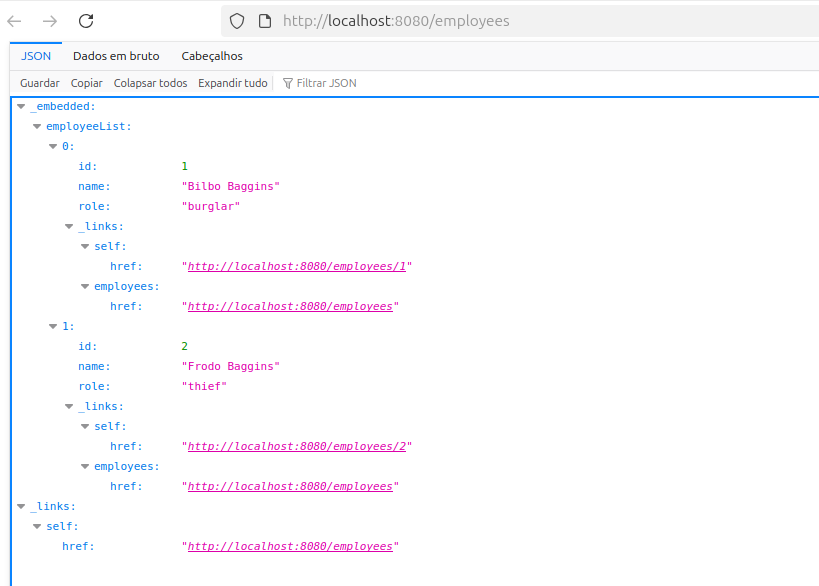

---

# Conclusion

This part of CA5 demonstrates different Dockerization techniques for a Spring Boot REST API, increasing in optimization and efficiency:

* **v1** – simple, functional, but heavy
* **v2** – more efficient, relies on host build
* **v3** – best practice using multi-stage builds

---

# CA5 Part 2 – Multi-Container Orchestration with Docker Compose

## Overview

In Part 2, the goal is to deploy the Spring Boot REST API (from CA2-part2) together with an external **H2 database server**, using **two separate containers** orchestrated by **Docker Compose**:

- `h2-db` – H2 database running in TCP server mode  
- `spring-web` – Spring Boot REST API that connects remotely to the H2 server

Both containers share a Docker network (created automatically by Compose) and the database uses a **named volume** to persist data.

---

## Project Structure (Part 2)

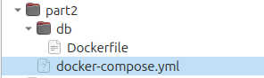

The Spring project reused in this part is:

```text
CA5/CA2-part2/rest
```

which already contains the `dockerfile-multi-stage` used in Part 1 (version 3).

---

## H2 Database Dockerfile

The `CA5/part2/db/Dockerfile` builds a small image with **eclipse-temurin:17-jre** and downloads H2 2.2.224 directly from Maven Central:

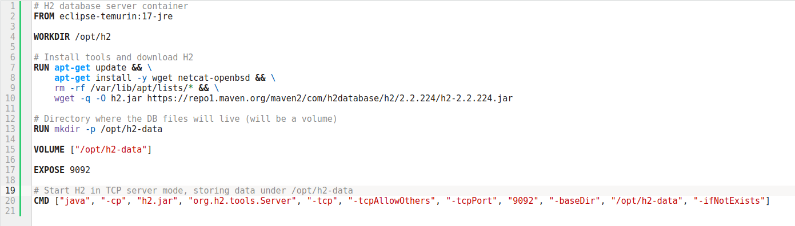

Key points:

* Uses **TCP server mode** so other containers can connect (`-tcp` / `-tcpAllowOthers` / `-tcpPort 9092`).
* Stores all database files under `/opt/h2-data`, which is mounted as a **Docker volume**.
* The `-ifNotExists` flag allows the remote Spring application to create the `payrolldb` database on first connection.

---

## docker-compose.yml: Web + DB

The `CA5/part2/docker-compose.yml` defines two services and one named volume:

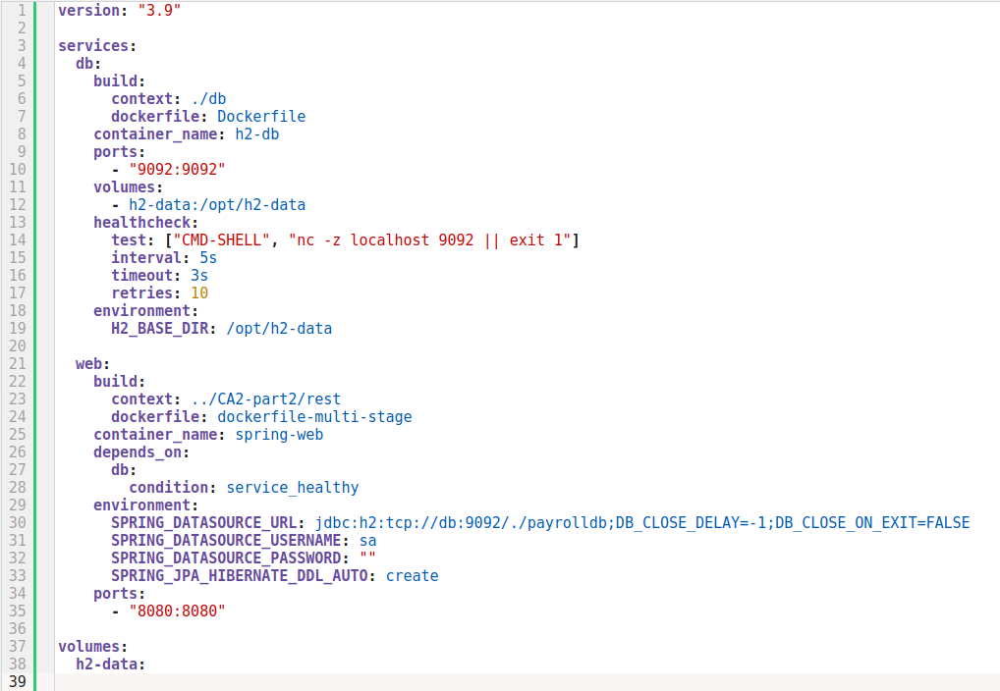

### Important details

* **Two services**: `db` (H2) and `web` (Spring Boot).
* The `db` service:

  * builds from `part2/db/Dockerfile`
  * exposes port **9092**
  * mounts the named volume `h2-data:/opt/h2-data`
  * has a **healthcheck** using `nc -z localhost 9092`
* The `web` service:

  * builds the API using the **multi-stage Dockerfile** (`dockerfile-multi-stage`)
  * depends on `db` being **healthy** before starting
  * uses environment variables to configure the Spring `DataSource`
  * sets `SPRING_JPA_HIBERNATE_DDL_AUTO=create` so that Hibernate creates the tables and sequences in the new H2 database
  * exposes port **8080** for HTTP access

Because both services are in the same Compose file, they automatically share the default internal network, so the Spring app connects to the database using the hostname `db`.

---

## Running the Multi-Container Environment

From the `CA5/part2` directory:

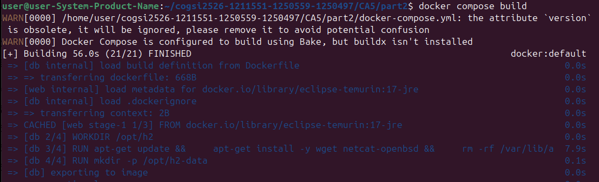


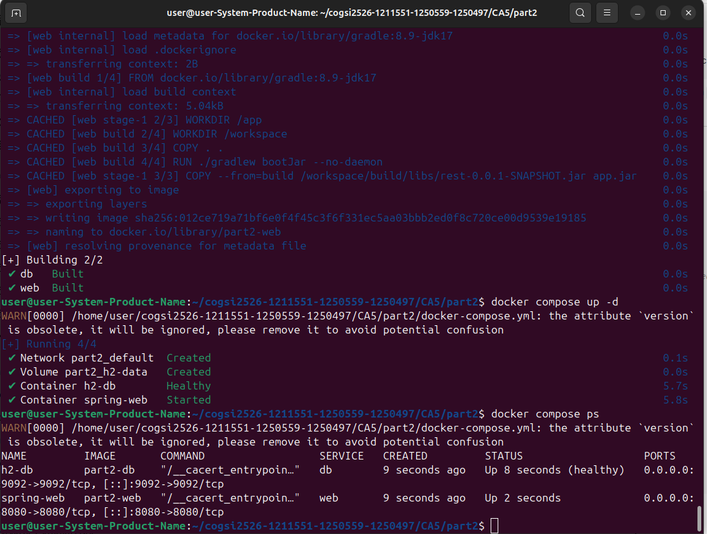

Example `docker compose ps` output:


To see the logs:

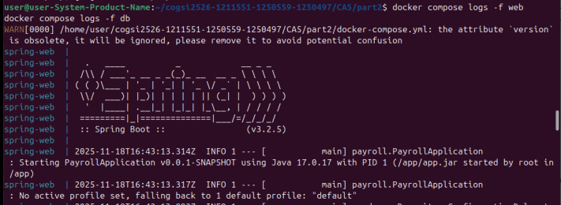

The `web` logs show that the application successfully connects to H2 and preloads two demo employees:

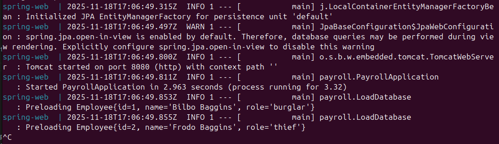

---

## Testing the REST API

With both containers running, the API is available at:

```text
http://localhost:8080/employees
```

This confirms that:

* the **Spring Boot application** is running in its own container (`spring-web`);
* it connects to the **H2 server** running in another container (`h2-db`);
* the schema was created automatically and the initial data was inserted.

---

# Alternative Tool: LXD - Part 1

This document describes the alternative approach to containerization using **LXD** instead of Docker, as required by the CA5 project.  
While the original part of CA5 uses Docker (Dockerfile.v1, v2, etc.), this alternative demonstrates how the same applications can be isolated, built, and executed using LXD system containers.  
The alternative includes two applications:

- **Chat Application** (Gradle, Java)
- **REST API – Payroll Example** (Spring Boot)

The goal is to reproduce the behaviour previously implemented with Docker, but using the LXD technology stack, showing understanding of containerization concepts beyond Docker.

# 1. Introduction: Why LXD as an alternative?

LXD is a system container manager, closer to a lightweight virtual machine, unlike Docker which uses application-level containers. LXD provides:

- Full Linux system per container (with its own init, networking, filesystem)
- Better isolation than Docker's namespace-only approach
- Built-in high-level tools (`lxc exec`, `lxc file push`, profiles, storage pools)
- Natural support for multi-service environments without Docker compose
- More visibility and control over the OS environment

Compared with Docker:

| Feature | Docker | LXD |
|--------|--------|------|
| Container type | Application-level | System-level |
| OS inside container | Minimal | Full OS image (Ubuntu, Alpine, etc.) |
| Build system | Dockerfile | Manual commands or scripts |
| Networking | Bridges + port mappings | Bridges, NIC types, routed mode |
| Use case | Microservices | Lightweight VMs, full-service environments |

This makes LXD a good pedagogical alternative to show containerization without relying solely on Docker.

---

# 2. Preparing the Environment (WSL + LXD)

LXD was installed in the WSL Ubuntu environment using:

```bash
sudo snap install lxd
sudo lxd init
```

These commands will:

Install the LXD container manager using Snap

Launch the guided initialization wizard (lxd init)

Set up the default storage pool, bridge network, and security settings

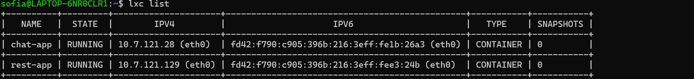

---

# 3. Creating the Two Required Containers

Two containers were launched: one for the chat server, and one for the REST API.

```bash
lxc launch ubuntu:22.04 chat-app
lxc launch ubuntu:22.04 rest-app
```

---

# 4. Copying the Project Into the Containers

Since the GitHub repository is private and cannot be cloned via SSH inside LXD,  
the approach used was:

1. Clone repository on host (WSL)
2. Copy repository to each container using `lxc file push`

Example:

```bash
lxc exec chat-app -- mkdir -p /root/repo
lxc file push -r cogsi2526-1211551-1250559-1250497/chat-app/root/repo/
```
The same structure was copied to `rest-app`.

---

# 5. Installing Dependencies Inside Each Container

Both applications use Java and Gradle.  
Inside each container:

```bash
apt install -y openjdk-17-jdk git gradle
```

---

# 6. Building the Chat Application (Inside LXD)

Inside the chat-app container:

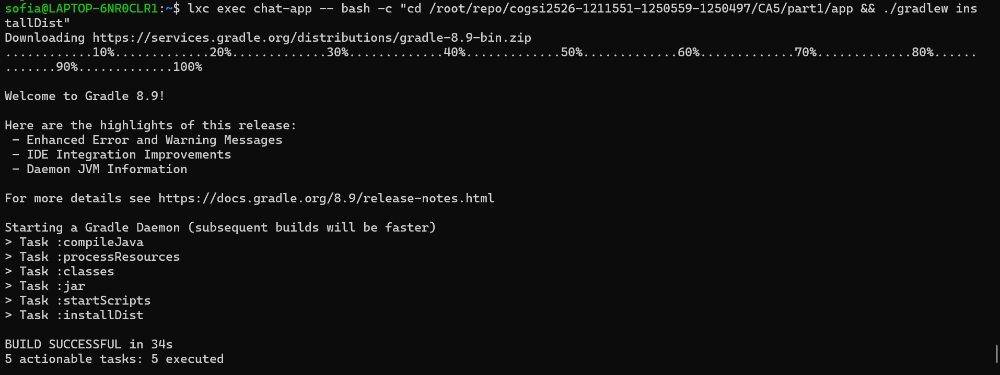

This mirrors exactly the Docker build (Dockerfile.v1),  
but executed directly inside an LXD system container instead of a Docker image layer.

---

# 7. Running the Chat Application in LXD

The chat server was started using:

```bash
lxc exec chat-app -- bash -c "cd /root/repo/.../build/install/basic_demo/lib && java -cp '*' basic_demo.ChatServerApp 59001"
```

Expected output: The chat server is running...

Then, from WSL, a connection was tested using netcat: 

```bash
nc <chat-app-IP> 59001
```
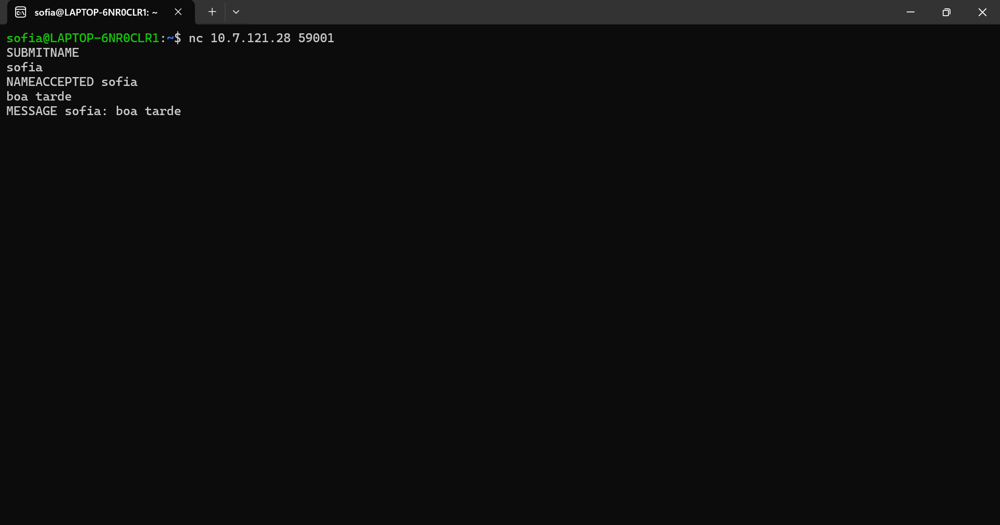

Where `<chat-app-IP>` was obtained from:
When connecting, the server requested a username (SUBMITNAME).
After submitting a username and sending a chat message, the expected interaction was:

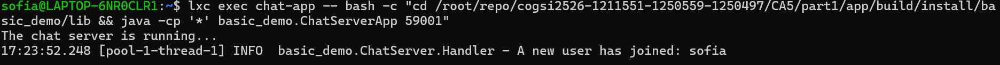

---

# 8. Building the REST API (Inside LXD)

Inside rest-app:

```bash
cd /root/repo/.../CA2/CA2-part2/rest
./gradlew build
```

This builds the Spring Boot JAR under:

```bash
build/libs/rest-0.0.1-SNAPSHOT.jar
```

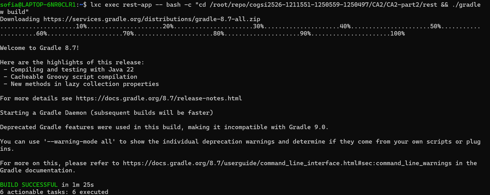

---

# 9. Running the REST API in LXD

The Spring Boot server was started with:

```bash
lxc exec rest-app -- bash -c "cd /root/repo/.../rest/build/libs && java -jar rest-0.0.1-SNAPSHOT.jar"
```

Expected output:

- Tomcat started on port 8080
- JPA/H2 database initialized
- Demo employees loaded

Testing from host:

```bash
curl http://<rest-app-IP>:8080/employees
```


