# **CA6 – CI/CD Pipelines (Jenkins)**

## **Objectives**

The objective of this assignment is to design and implement automated **CI/CD pipelines** using **Jenkins**, integrating build, testing, artifact management, and deployment processes for the Spring Boot application.

CA6 is divided into **two main parts and one alternative**:

* **Part 1:** Creation of a Jenkins pipeline that builds and tests the application, manages artifacts, and deploys it to Vagrant-provisioned VMs using Ansible, including approval steps, tagging, health checks, and rollback automation.

* **Part 2:** Extension of the pipeline to build and publish Docker images to Docker Hub, run tests in parallel, and deploy the containerized application to a production VM.

* **Alternative:** Design and analysis of an equivalent CI/CD solution using another automation tool, comparing it with Jenkins.

---

# **Comparative Analysis: CI/CD Orchestration Tools (Jenkins and Alternatives)**

Modern software delivery relies heavily on **automation pipelines**, enabling teams to continuously integrate and continuously deliver software with quality and speed.
For CA6, Jenkins is used as the primary CI/CD tool , but several alternative tools exist, each with different architectures, workflows, and strengths.

This analysis compares **Jenkins**, **GitHub Actions**, **GitLab CI/CD**, **Azure DevOps Pipelines**, and **Tekton**, focusing on architecture, extensibility, pipeline definitions, ecosystem, and ideal use cases.
The goal is to understand how Jenkins fits into the CI/CD space and how an alternative could also meet CA6's requirements.

---

# **Jenkins**

**Jenkins** is one of the most widely used open-source CI/CD automation servers. Its architecture is based on a **centralized server with agents** that execute jobs, and pipelines are defined via **Jenkinsfiles** — exactly what CA6 requires .

It is highly extensible thanks to 1800+ plugins and can interact with virtually any development tool, build system, SCM, or deployment platform.

### **Advantages**

* Completely open-source and highly customizable.
* Huge plugin ecosystem — supports any technology stack.
* Mature support for pipeline-as-code (`Jenkinsfile`), as required in CA6.
* Supports distributed builds across multiple agents.
* Highly flexible for DevOps, on-premise, or private infrastructure.

### **Shortcomings**

* Requires maintenance of the Jenkins master and agents.
* UI and configuration can feel dated compared to modern cloud-native tools.
* Plugin dependency issues may occur.
* Security requires careful configuration.

**Best suited for**: customizable pipelines, on-premise automation, heterogeneous environments, and academic environments where full control is required (e.g., CA6).

---

# **GitHub Actions**

**GitHub Actions** is GitHub’s built-in CI/CD system, tightly integrated with repositories.
Workflows run in hosted runners (or self-hosted ones) and are defined using YAML files.

### **Advantages**

* Native GitHub integration — triggers on pushes, pull requests, tags, etc.
* Zero server maintenance (fully SaaS).
* Marketplace with thousands of reusable actions.
* Extremely easy to set up.
* Free minutes for students.

### **Shortcomings**

* Limited customizability compared to Jenkins.
* Hosted runners may impose restrictions (timeouts, networking rules).
* Running complex infrastructure provisioning (e.g., Vagrant + Ansible) may be more difficult.
* Vendor lock-in.

**Best suited for**: GitHub-based development, lightweight container builds, cloud-native pipelines, fast automation.

---

# **GitLab CI/CD**

GitLab provides a built-in CI/CD module integrated into the GitLab ecosystem.
Similar to GitHub Actions, pipelines are defined in YAML (`.gitlab-ci.yml`).

### **Advantages**

* Deep integration with GitLab’s issue tracking, repositories, and deployments.
* Auto DevOps features.
* Docker-based runners simplify containerized builds.
* Very easy setup with rich UI feedback.

### **Shortcomings**

* Requires GitLab (cloud or self-hosted).
* More opinionated than Jenkins; less flexible for non-container workloads.
* Infrastructure automation sometimes harder than with Jenkins.

**Best suited for**: organizations using GitLab as their main DevOps platform.

---

# **Azure DevOps Pipelines**

Microsoft’s enterprise CI/CD tool, supporting YAML pipelines and complex enterprise workflows.

### **Advantages**

* Enterprise-grade features for large organizations.
* Integrated boards, repos, pipelines, test plans, and artifacts.
* Good support for containerized builds and deployments.
* Many hosted agent options.

### **Shortcomings**

* Complexity is high.
* Not ideal for small student projects.
* Best features require paid plans.

**Best suited for**: large companies with Microsoft-based workflows.

---

# **Tekton**

Tekton is a *cloud-native* CI/CD framework built on Kubernetes.
Instead of servers/agents, Tekton uses **Kubernetes CRDs** to run tasks, pipelines, and workspaces.

### **Advantages**

* Fully Kubernetes-native.
* Highly modular and reusable pipeline components.
* Cloud-ready, scalable, modern architecture.
* Vendor-neutral (part of the CD Foundation).

### **Shortcomings**

* Requires Kubernetes cluster — heavier to set up than Jenkins.
* Complex for beginners.
* Lacks the huge plugin ecosystem of Jenkins.

**Best suited for**: cloud-native teams running CI/CD entirely inside Kubernetes clusters.

---

# **Comparison Summary Table**

| Tool                | Architecture             | Ease of Setup | Extensibility | Best Use Case                  | Notes                                |
| ------------------- | ------------------------ | ------------- | ------------- | ------------------------------ | ------------------------------------ |
| **Jenkins**         | Server + agents          | Medium        | Very High     | Custom CI/CD, on-prem, CA6     | Plugin-rich but requires maintenance |
| **GitHub Actions**  | Cloud runners (SaaS)     | Very High     | High          | GitHub repos, container builds | Simplest option                      |
| **GitLab CI/CD**    | Integrated cloud/on-prem | High          | High          | GitLab-based DevOps            | Excellent integration                |
| **Azure Pipelines** | Cloud-hosted enterprise  | Medium        | High          | Corporate pipelines            | Enterprise-oriented                  |
| **Tekton**          | Kubernetes-native        | Low           | Medium-High   | Cloud-native CI/CD             | Requires Kubernetes                  |

---

# Alternative with GitHub Actions (Blue/Green + Rollback) - Part 1

## Objective

This CA6 alternative replaces Jenkins with **GitHub Actions** to implement:

* **CI/CD** pipeline for the Spring Boot application (`CA6/spring-example`)
* **Blue/Green Deployment** using Vagrant + Ansible
* **Automatic Rollback** to a stable tagged version (`stable-vX`)

> **Note:** The repository had to be made public in order to use GitHub Actions for this alternative, as some features (such as self-hosted runners and artifact handling) were required for the CI/CD workflow.

---

## Project File Structure

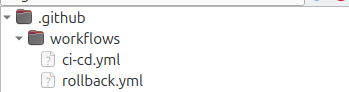

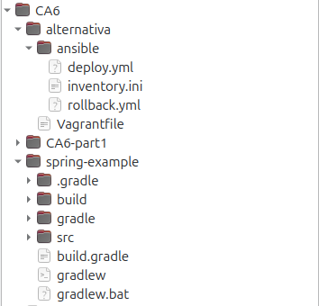

---

## Infrastructure (Vagrant + Blue/Green)

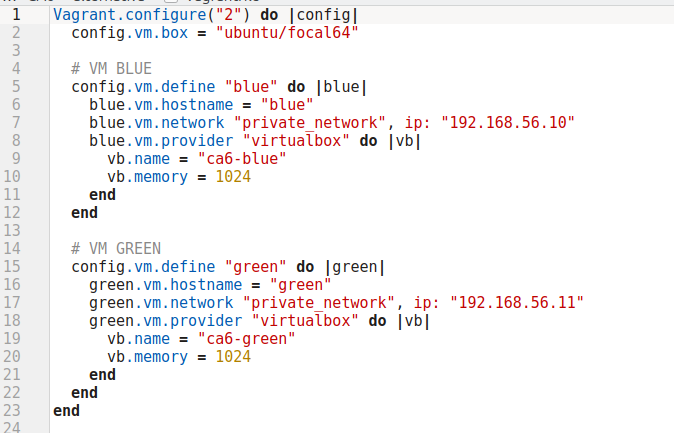

The file `CA6/alternativa/Vagrantfile` creates two Ubuntu VMs using VirtualBox:

* **blue** – IP: `192.168.56.10`
* **green** – IP: `192.168.56.11`

First command is:

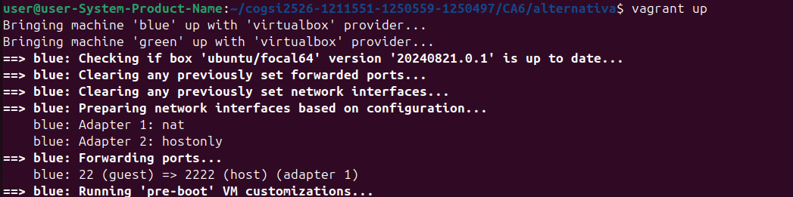

The Vagrant-generated private keys are stored in:

```text
CA6/alternativa/.vagrant/machines/*/virtualbox/private_key
```

Ansible uses these keys (configured in `inventory.ini`) to SSH from the self-hosted runner.


To test if the VMs are working we use this command:

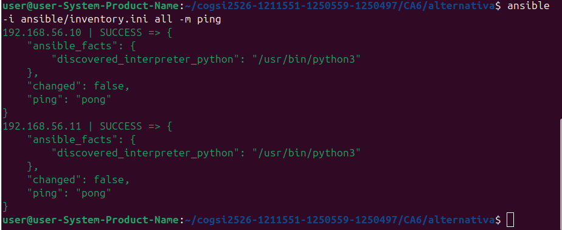

---

## Provisioning with Ansible

### Inventory (`ansible/inventory.ini`)

Simplified example:

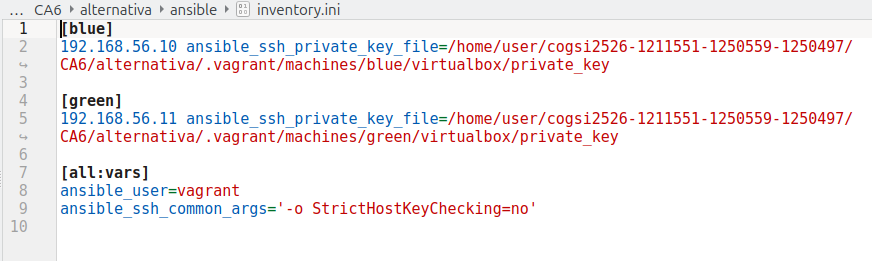

> The `private_key` paths are **absolute paths** on the host running the self-hosted runner.

---

## Deployment (`ansible/deploy.yml`)

This playbook automates the deployment of the Spring Boot application on the virtual machines. It installs the required runtime, deploys the JAR, configures the application as a system service, and validates that the API is running correctly.

---

## Environment Setup (Java + App Directory)

The playbook begins by installing **Java 17**, which is required for running the Spring Boot application.
It then creates the `/opt/app` directory where the application will be stored.

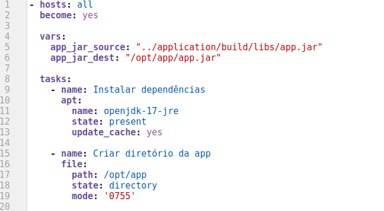

---

## Deploying the Application (Copy JAR + systemd Service)

Next, the built JAR file is copied to the target machine.
A `systemd` service file (`app.service`) is created so the application runs as a managed background service and restarts automatically if it stops.

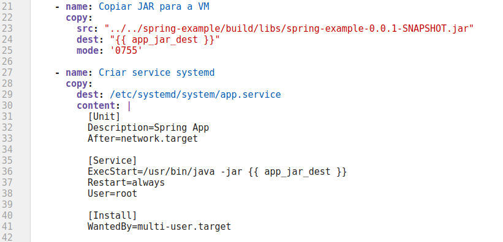

After creating the service, systemd is reloaded and the application is started and enabled at boot.

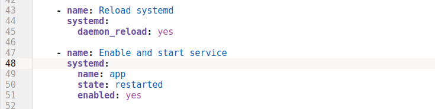

---

## Application Health Check

To ensure the application is running correctly, the playbook waits for port **8080** to become available and then performs a simple HTTP request to the `/employees` endpoint.
If the endpoint returns **200 OK**, the deployment is considered successful.

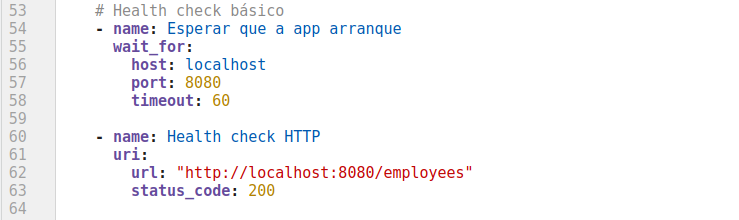

Deployment runs only on the **green** VM:

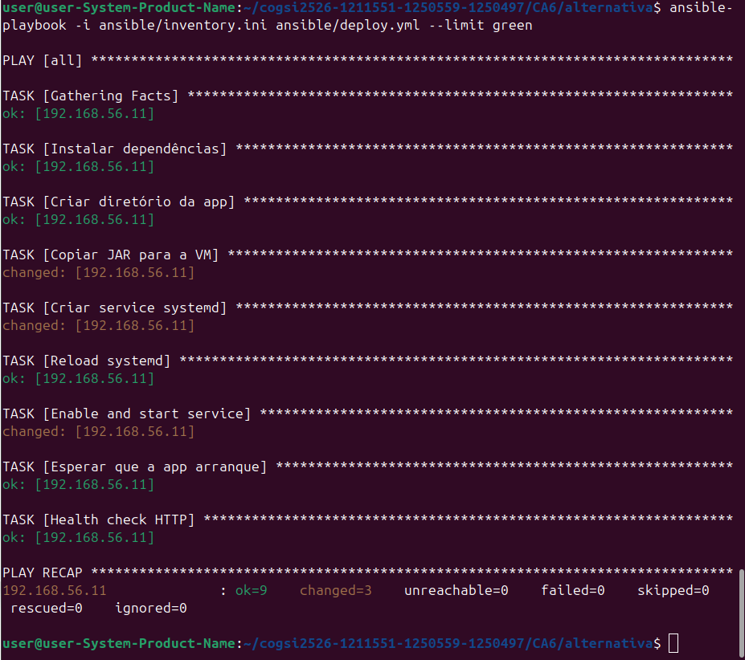

---

## Self-hosted Runner

Runner was configured at:

```text
/home/user/actions-runner
```

Using:

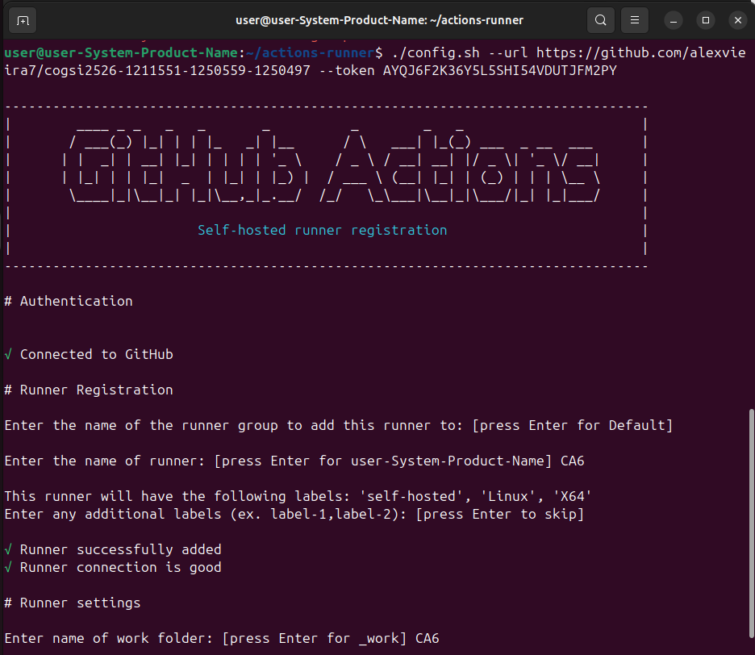

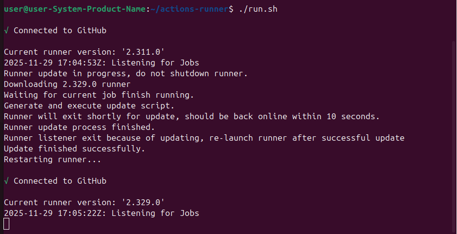

Workflow uses:

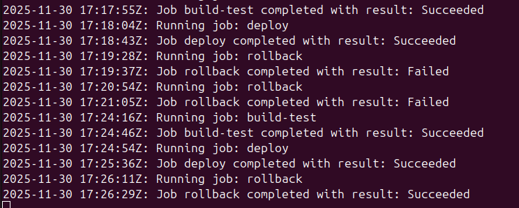

This allows GitHub Actions to:

* access the Vagrant VMs (network `192.168.56.x`)
* use Ansible and Vagrant SSH keys available on the machine

---

## GitHub Actions – CI/CD (`.github/workflows/ci-cd.yml`)

This workflow defines a full **CI/CD pipeline** for the Spring Boot application in `CA6/spring-example`, running on a **self-hosted runner**.

It is split into two jobs:

* **`build-test`** → Continuous Integration (build + tests + artifact)
* **`deploy`** → Continuous Deployment (deploy to GREEN + health check + tagging + rollback artifact)

---

### Trigger

The pipeline runs automatically on every `push` to the **`main`** branch:


This ensures that every change merged into `main` is built, tested, and (if successful) deployed.

---

### CI: `build-test` Job

The **`build-test`** job is responsible for the **Continuous Integration** part: compiling the project, running tests, and publishing the build artifact.

It runs on the **self-hosted runner**:

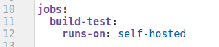

### Steps (CI – `build-test` job)

The pipeline checks out the repository, installs JDK 17, builds the Spring Boot project, runs the tests, and finally uploads the generated JAR as an artifact for the deployment stage. If any of these steps fail, the workflow stops and no deployment occurs.

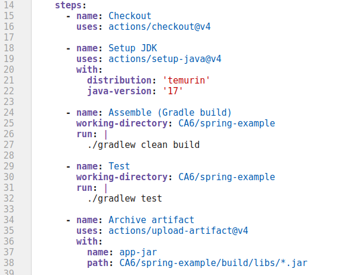

If any of these steps fail (build or tests), the pipeline stops and the application is **not deployed**.

---

### CD: `deploy` Job

The **`deploy`** job handles the **Continuous Deployment** part.
It only runs **if `build-test` succeeds**:

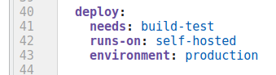

Main steps:

**Checkout repository and Download artifact**

Retrieves the JAR artifact created in the `build-test` job.

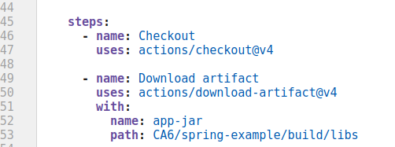


**Normalize JAR name**

   Picks the correct executable JAR (excluding `-plain`) and renames it to `app.jar`, which is what the Ansible playbook expects.

   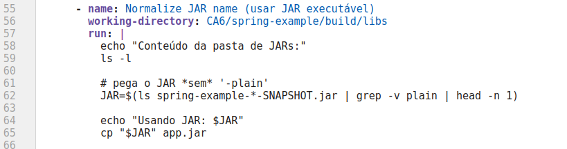

**Deploy to GREEN with Ansible and Health check from runner**

   Calls the Ansible playbook (`ansible/deploy.yml`) to deploy the application to the **GREEN** environment and verifies from the runner that the application is reachable and responding correctly on the `/employees` endpoint.

   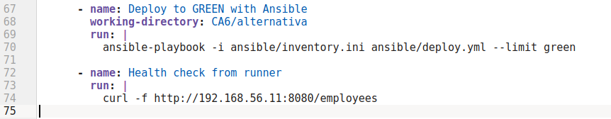

**Create stable tag and save artifact for rollback**

   If deployment succeeds:

   * creates a **tag** like `stable-v<run_number>` and pushes it to the repository
   * saves a copy of the deployed JAR in `CA6/alternativa/artifacts/` for **rollback** purposes.

   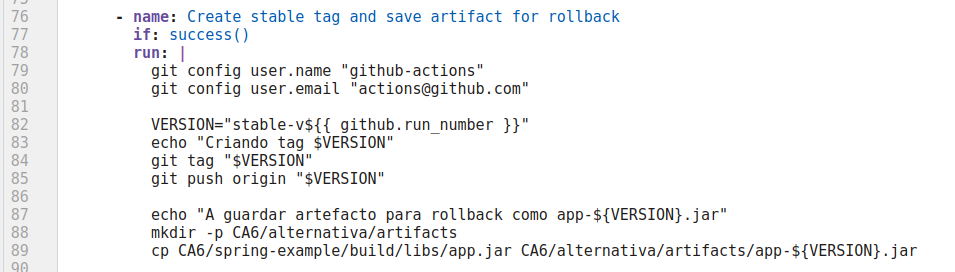

---

## CI Execution on Commit

Whenever a new **commit is pushed to the `main` branch**, GitHub Actions automatically triggers the **CI stage** of the pipeline. This ensures that every change is immediately validated by compiling the project, running tests, and generating the application artifact.

If all steps complete successfully, the workflow shows a green **“Success”** status in GitHub Actions, confirming that the code is stable and ready for deployment.

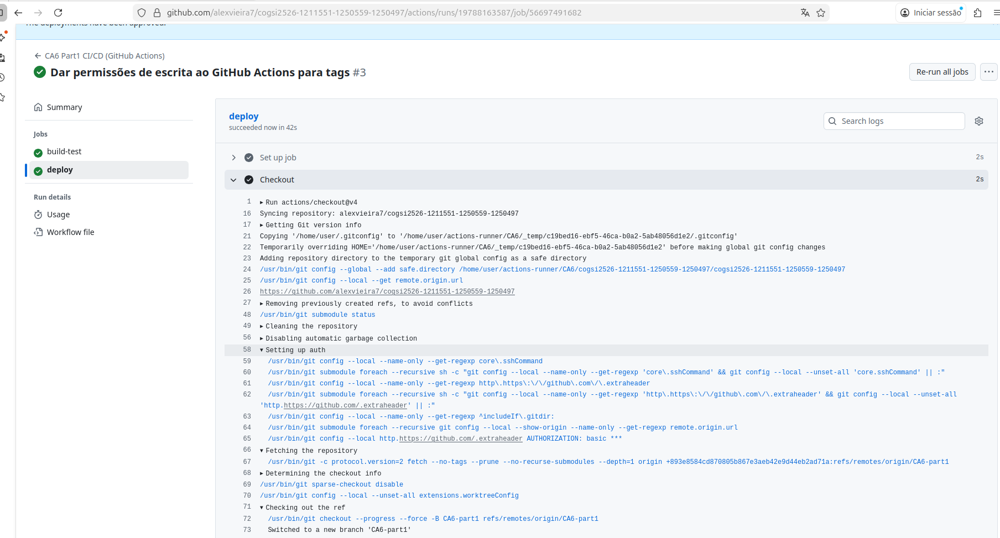

---

Here’s a polished version of the **Rollback** section, already adapted to match the **GitHub Actions rollback workflow** you sent.

---

# **Rollback Mechanism (GitHub Actions + Ansible)**

## Rollback to Stable Versions (`stable-vX`)

In addition to the CI/CD pipeline and Blue/Green deployment strategy, this project implements a **rollback mechanism** that allows reverting to a previously stable version using:

* GitHub Actions
* Ansible
* Vagrant (Green VM)
* Stable version tags (`stable-v1`, `stable-v2`, …)

Every successful deployment to the **green** environment creates a new stable tag, for example:

```text
stable-v1, stable-v2, stable-v3, ...
```

and stores the corresponding JAR file in:

```text
CA6/alternativa/artifacts/app-stable-vX.jar
```

These stored artifacts are later used as rollback candidates.

---

## How the Rollback Workflow Works

The rollback is triggered manually through GitHub Actions using `workflow_dispatch`, where the user selects the stable tag to restore (e.g., `stable-v5`):

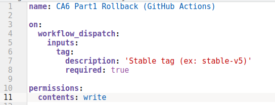

The `rollback` job runs on the self-hosted runner and performs three essential steps:

**Checkout the repository and Verify the rollback artifact**
Retrieves the repository with full history (required for tags) and without cleaning the workspace. Ensures that the JAR for the selected tag exists. If not, the workflow stops.

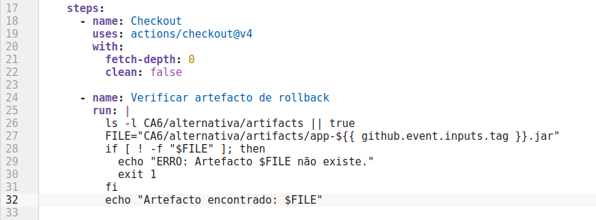


**Run the Ansible rollback playbook**
Executes the rollback by replacing the current app JAR on the green VM and restarting the service.

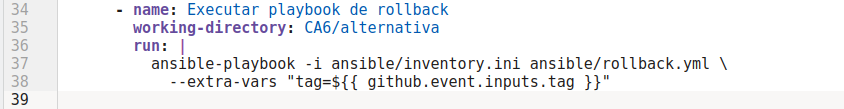

The Ansible playbook stops the running service, deploys the selected stable JAR, restarts the application, waits for it to start, and performs an HTTP health-check.
If the check fails, GitHub Actions reports an error and the rollback is not applied.

---

## Rollback Playbook (`ansible/rollback.yml`)

Location:

```
CA6/alternativa/ansible/rollback.yml
```

The playbook performs:

* stop the current Spring Boot service
* copy the stable JAR to `/opt/app/app.jar`
* restart the service using `systemd`
* wait for port **8080** to become available
* perform a final health-check

Simplified version:

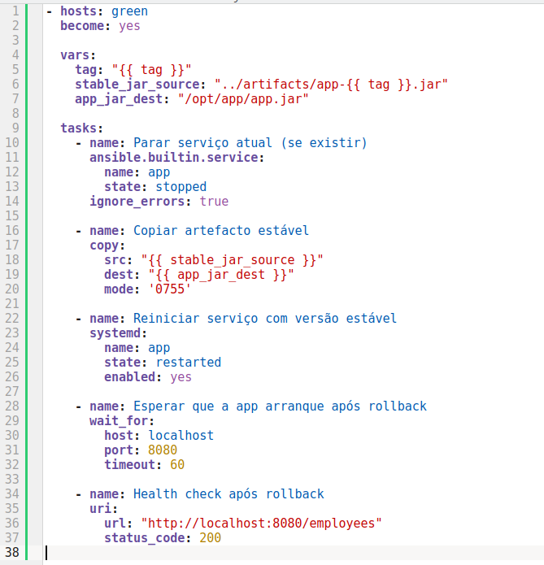

This ensures the application actually starts before performing the verification.

---

## Rollback Workflow (GitHub Actions)

The rollback workflow is located at:

```
.github/workflows/rollback.yml
```

and is triggered manually using:

```
Actions → CA6 Part1 Rollback → Run workflow
```

The user must provide a stable tag (e.g., `stable-v6`).
The workflow then performs:

1. Repository checkout
2. Validation that the artifact `app-stable-vX.jar` exists
3. Execution of the rollback Ansible playbook
4. Final verification (health-check)

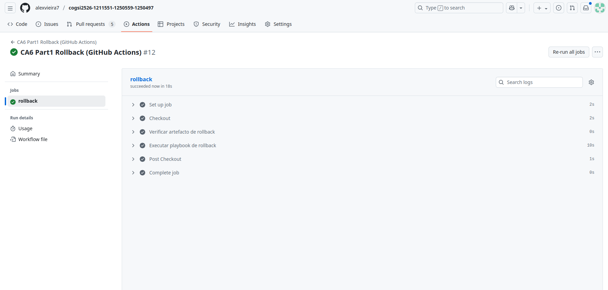

Thanks to the artifacts stored on the self-hosted runner, **rollback does not rebuild the application**—it simply switches to a previously validated version.

---

# Alternative with GitHub Actions - Part 2

GitHub Actions + Docker + Vagrant + Ansible**

## **1. Objective**

This alternative replaces Jenkins (from the official CA6-Part2 instructions) with a pure **GitHub Actions CI/CD pipeline** using:

* **Docker** (containerization of the Spring Boot app)
* **Docker Hub** (image registry)
* **Vagrant + VirtualBox** (production VM)
* **Ansible** (container deployment automation)

The workflow automatically:

1. Runs unit + integration tests
2. Builds a JAR
3. Builds and pushes a Docker image
4. Deploys and runs the container inside a Vagrant VM
5. Performs an automated health check

---

## **2. Project Structure (Part 2)**

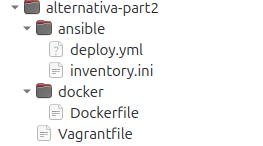

---

## **Infrastructure Setup (Vagrant)**

The file:

```
CA6/alternativa-part2/Vagrantfile
```

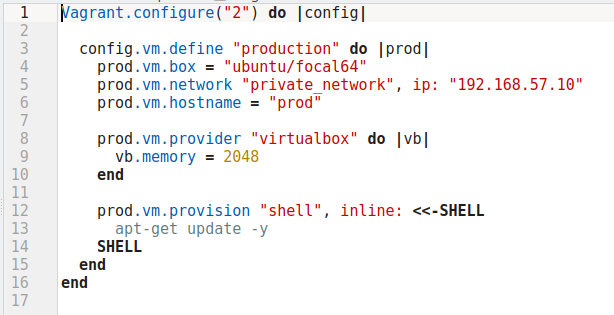

Creates a VM named **production**, with:

* IP: `192.168.57.10`
* Ubuntu 20.04
* automatic provisioning (apt update)

### Start the VM

```bash
vagrant up
```

Check status:

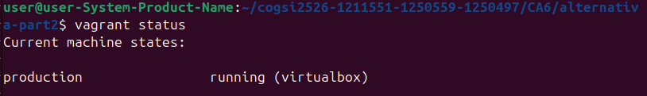

SSH inside:

```bash
vagrant ssh production
```

---

## **Ansible Configuration**

### **Inventory file**

```
CA6/alternativa-part2/ansible/inventory.ini
```

Example:

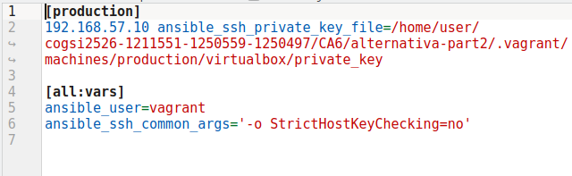

### **Deployment Playbook (`deploy.yml`)**

This playbook:

1. Installs Docker
2. Logs in to Docker Hub
3. Pulls the latest image
4. Stops existing container (if any)
5. Runs the new container on port 8080
6. Waits for the service to start
7. Performs a health check

**File:** `CA6/alternativa-part2/ansible/deploy.yml`

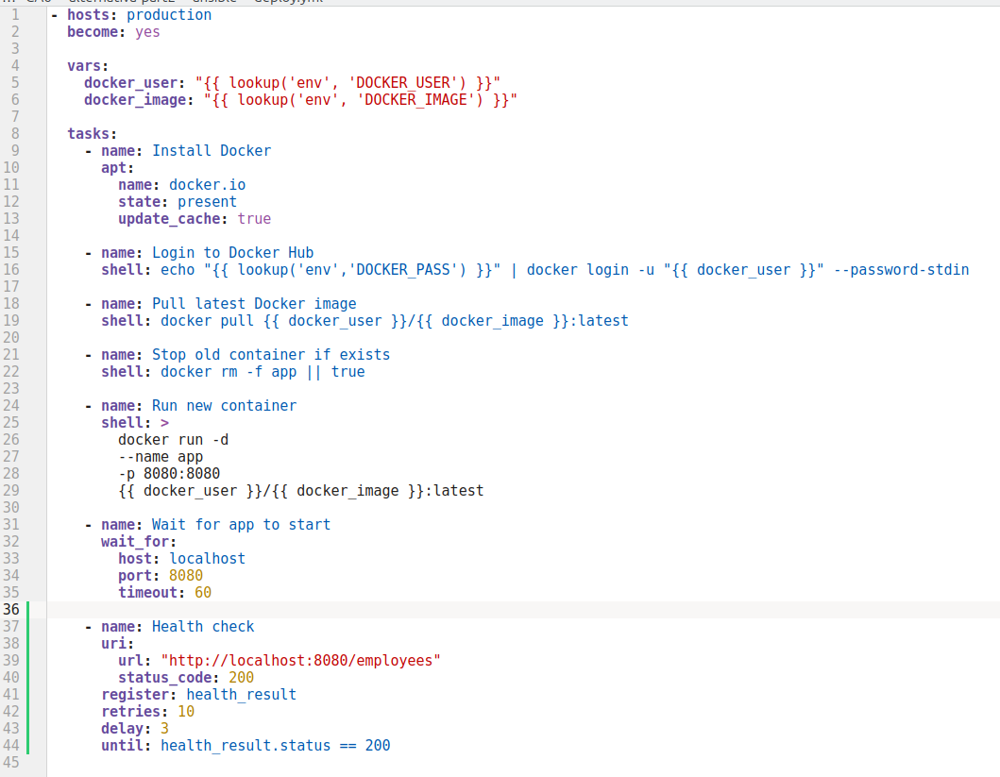

---

## **GitHub Secrets Required**

Go to:

**GitHub → Repository → Settings → Secrets and variables → Actions**

Create:

| Secret name    | Description                           |
| -------------- | ------------------------------------- |
| `DOCKER_USER`  | Your Docker Hub username              |
| `DOCKER_PASS`  | Docker Hub password or access token   |
| `DOCKER_IMAGE` | Repository name (ex: `cogsi-ca6-app`) |

---

## **Dockerfile**

Located at:

```
CA6/spring-example/Dockerfile
```

Used to build the container:

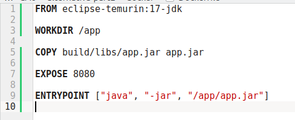

---

## **GitHub Actions Workflow (CI/CD)**

File:

```
.github/workflows/ci-cd-part2.yml
```

The pipeline has **4 jobs**:

### ✔ 1. unit-tests

Runs standard Gradle tests.

### ✔ 2. integration-tests

Runs integration tests (same command as above, optional separation).

### ✔ 3. docker-build-push

Builds the app + Docker image and pushes to Docker Hub.

### ✔ 4. deploy

Runs Ansible to deploy the new container into the Vagrant VM.

---

### **Full CI/CD workflow**

```yaml
name: CA6 Part2 CI/CD (GitHub Actions)

on:
  push:
    branches: [ CA6-part2 ]

env:
  DOCKER_USER: ${{ secrets.DOCKER_USER }}
  DOCKER_PASS: ${{ secrets.DOCKER_PASS }}
  DOCKER_IMAGE: ${{ secrets.DOCKER_IMAGE }}

jobs:
  unit-tests:
    runs-on: self-hosted
    steps:
      - uses: actions/checkout@v4
      - uses: actions/setup-java@v4
        with:
          distribution: temurin
          java-version: 17
      - run: ./gradlew test
        working-directory: CA6/spring-example

  integration-tests:
    runs-on: self-hosted
    steps:
      - uses: actions/checkout@v4
      - uses: actions/setup-java@v4
        with:
          distribution: temurin
          java-version: 17
      - run: ./gradlew test
        working-directory: CA6/spring-example

  docker-build-push:
    runs-on: self-hosted
    needs: [unit-tests, integration-tests]
    steps:
      - uses: actions/checkout@v4
      - uses: actions/setup-java@v4
        with:
          distribution: temurin
          java-version: 17

      - run: ./gradlew clean build
        working-directory: CA6/spring-example

      - name: Normalize JAR name
        working-directory: CA6/spring-example
        run: |
          JAR=$(ls build/libs/*SNAPSHOT.jar | grep -v plain | head -n 1)
          cp "$JAR" build/libs/app.jar

      - name: Login Docker Hub
        run: echo "$DOCKER_PASS" | docker login -u "$DOCKER_USER" --password-stdin

      - name: Build Docker image
        working-directory: CA6/spring-example
        run: |
          docker build \
            -t $DOCKER_USER/$DOCKER_IMAGE:latest \
            -f ../alternativa-part2/docker/Dockerfile .

      - name: Push Docker image
        run: docker push $DOCKER_USER/$DOCKER_IMAGE:latest

  deploy:
    runs-on: self-hosted
    needs: docker-build-push
    steps:
      - uses: actions/checkout@v4
      - run: ansible-playbook -i ansible/inventory.ini ansible/deploy.yml
        working-directory: CA6/alternativa-part2
```

---

## **How to Run the Entire Pipeline**

### **Start self-hosted runner**

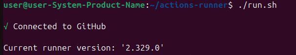

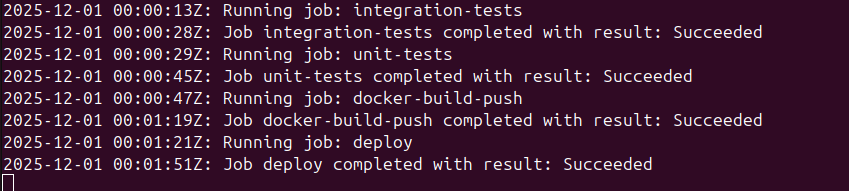

### **Ensure the VM is running**

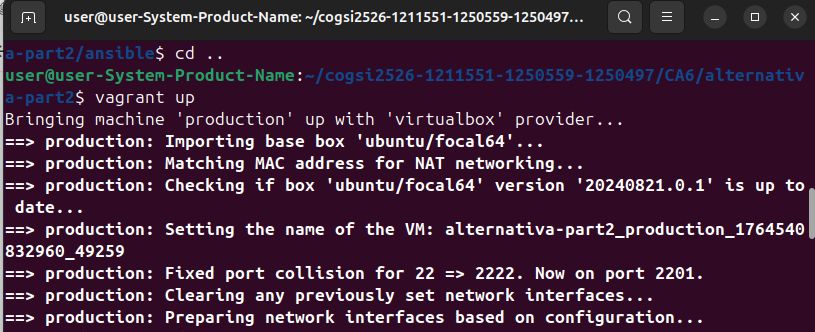

### **Push to the CA6-part2 branch**

```bash
git add .
git commit -m "CA6 Part2 working CI/CD"
git push origin CA6-part2
```

### **GitHub Actions triggers automatically**

Check in:

**GitHub → Actions → CA6 Part2 CI/CD**

All steps should become green ✔
The app becomes available at:

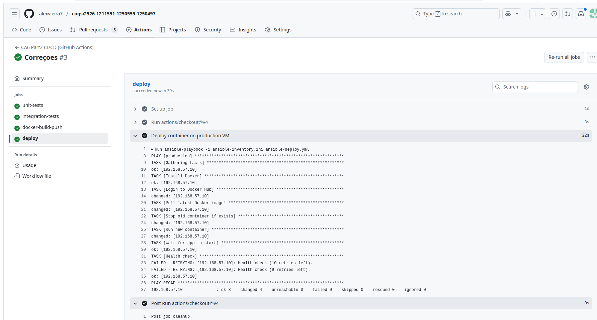

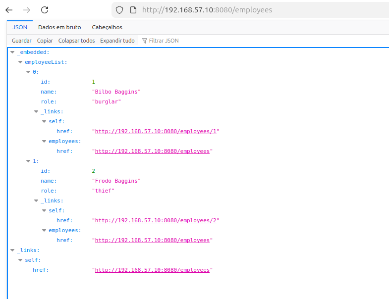

---

# Self-Assessment of Contributions

| Membro | ID | Contribuição (%) |
|---------|----|------------------|
| Sofia Marques | 1250559 | 33.3% |
| Alexandre Vieira | 1211551 | 33.3% |
| Bárbara Silva | 1250497 | 33.3% |


